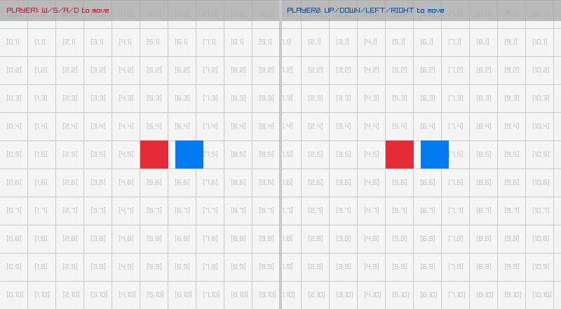

# Examples

Animated GIF previews of every example. Regenerate with `bb record` (requires the internal capture tool; the GIFs here are committed, so you do not need it to browse them).

## games

### asteroids

the classic vector shooter (rotate/thrust/fire)

### tetris

the block-stacking puzzle (move/rotate/drop)

### pong

two-paddle classic, you (W/S) vs a CPU

### vampire-survivors

auto-fire survival: move, waves chase you

### snake

the classic snake (arrow keys, grow, don't crash)

### breakout

paddle + ball + brick grid (mouse paddle)

### space-invaders

marching aliens (arrows + SPACE to shoot)

### flappy-bird

flap through the pipe gaps (SPACE)

### game-2048

2048: 4x4 tile-merge puzzle (arrow keys)

### minesweeper

reveal/flag grid (mouse L reveal, R flag)

## core

### basic-window

the minimal raylib window + text

### input-keys

steer a ball with the arrow keys

### input-mouse

a ball follows the mouse; click to recolor

### input-mouse-wheel

scroll a box with the mouse wheel

### camera-2d

a 2D camera over a skyline (struct-by-value)

### delta-time

per-frame vs delta-time movement

### scissor-test

a scissor rectangle clips a grid

### basic-screen-manager

a LOGO/TITLE/GAMEPLAY/ENDING flow

### random-values

a new random value every two seconds

### camera-2d-mouse-zoom

zoom toward the cursor, pinning the point under it

### camera-2d-platformer

five ways a camera can follow a jumping player

### input-gestures

tap, hold, drag and swipe, named as they happen

### random-sequence

bars in a shuffled order, each height used once

### storage-values

values that survive a restart, via a file

### undo-redo

move a square, then step back through the history

### window-letterbox

a fixed picture letterboxed into the window

### window-flags

toggle vsync/resizable/topmost live

### monitor-detector

every attached display, current one lit

### clipboard-text

type, C copies, V pastes

### input-gamepad

sticks, triggers and buttons for pad 0

### input-multitouch

touch points (the mouse is point 0)

### input-virtual-controls

an on-screen D-pad and action button

### window-should-close

close is a question: ESC asks before it exits

### keyboard-testbed

an on-screen ENG-US keyboard, every key lit

### input-actions

abstract input actions: keyboard + gamepad

### smooth-pixelperfect

sub-pixel camera smoothing at 5x upscale

### viewport-scaling

6 viewport-scaling policies, resize live

### highdpi-testbed

diagnostic overlay: monitors, DPI, crosshair

### compute-hash

CRC32/MD5/SHA1/SHA256 + Base64 of typed text

### camera-2d-split-screen

two players, two cameras, two render textures

## shapes

### bouncing-ball

a ball bouncing around the window

### basic-shapes

shape primitives + an rlgl triangle

### colors-palette

every named raylib color in a grid

### gradient

a vertical two-color gradient

### following-eyes

two eyes track the mouse

### starfield

a twinkling starfield

### logo-raylib

the raylib logo from rectangles + text

### mouse-trail

a fading trail follows the cursor

### recursive-tree

a binary fractal tree

### math-sine-cosine

a live unit-circle trig visualization

### bullet-hell

a rotating bullet spiral

### triangle-strip

a rainbow strip via rlgl immediate mode

### collision-area

AABB collision between two boxes

### dashed-line

a dashed line follows the mouse

### double-pendulum

chaotic double-pendulum motion + trail

### kaleidoscope

strokes mirrored with 6-fold symmetry

### hilbert-curve

a rainbow Hilbert space-filling curve

### circle-sector-drawing

a sector whose segment count you can starve

### easings-ball

slide, swell and fade, one curve each

### easings-box

drop, flatten, spin, grow, fade: five curves

### easings-rectangles

a grid easing out in size and rotation at once

### easings-testbed

one curve at a time, plotted and run

### ellipse-collision

two ellipses that redden when they overlap

### logo-anim

the raylib logo assembling itself, unsmoothed

### math-angle-rotation

fixed spokes + a spinning line

### rlgl-color-wheel

a hue wheel as a triangle fan, per-vertex colour

### ball-physics

2D balls under gravity, SPACE respawns

### lines-bezier

a cubic Bézier that follows the mouse

### color-wheel

an HSV color wheel (rlgl triangle fan)

### pie-chart

labelled pie slices via rl/sector!

### splines

Catmull-Rom / Bezier / B-spline (SPACE cycles)

### vector-angle

the angle between two vectors (arc + readout)

### easings

a grid of balls, each on a different easing curve

### penrose-tiling

a P3 Penrose rhombus tiling (deflation)

### analog-clock

a live analog clock (libc local time)

### digital-clock

a seven-segment HH:MM:SS clock (libc time)

### ring-drawing

an animated annulus via rl/ring!

### rounded-rectangle

rounded rects via sector! corners

### rectangle-scaling

drag the corner handle to resize a rect

### lines-drawing

a rotating fan of thick lines (line-ex!)

### starfield-effect

flying starfield (wheel=speed, SPACE=mode)

### rectangle-advanced

per-side roundness with a horizontal gradient

### rlgl-triangle

per-vertex colour interpolated across a face

## text

### font-sizes

font sizes + MeasureText centering

### writing-anim

a message types itself out

### format-text

padded score + MM:SS timer readouts

### words-alignment

align a word inside a box (MeasureText)

### input-box

type into a text box (GetCharPressed)

### rectangle-bounds

draggable word-wrap text container

## 3d

### camera-3d

an orbiting 3D camera (Camera3D by value)

### waving-cubes

an NxN grid of cubes rippling in 3D

### camera-3d-first-person

walk a yard of columns in first person

### tesseract-view

a rotating 4D hypercube projected to 2D

### wireframe-shapes

pyramid/octahedron/torus/helix in 3D lines

### rlgl-solar-system

Sun/Earth/Moon via the rlgl matrix stack

### box-collisions

a player cube colliding with 3D boxes

### rotating-cube

a single cube spinning via the rlgl matrix stack

### spinning-cubes

a row of cubes each spinning with a phase offset

### orthographic-projection

perspective vs orthographic (SPACE toggles)

### point-cloud

~1500 points as tiny rlgl cubes, rotating

### bouncing-spheres

spheres bouncing in a 3D box (rl/sphere!)

### lorenz-attractor

the Lorenz attractor traced in 3D

### dna-helix

a turning double helix, coloured bases

### yaw-pitch-roll

the three aircraft rotations in 3D

### first-person-maze

walk a grid maze, with a minimap

### world-screen

a 2D label tracks a cube via GetWorldToScreen

### geometric-shapes

cubes, spheres, cylinders, cones, capsules

### camera-3d-split-screen

two players, two render-texture halves

## generative

### game-of-life

Conway's Game of Life (SPACE reseeds)

### boids

flocking birds (separation/alignment/cohesion)

### fireworks

rockets + fading particle bursts

### fourier-epicycles

rotating circles trace a square wave

### spirograph

animated hypotrochoid roulette curves

### l-system

an L-system fractal plant (grows + regrows)

### flow-field

particles steered by a flow field (trails)

### clock-of-clocks

six digits spelled by a grid of clock hands

### cellular-automata

Wolfram's elementary automata

### particles

water/smoke/fire particles follow the mouse

## textures

### texture-procedural

four textures built pixel by pixel

### texture-tiling

one tile repeated across the window

### render-texture

a scene drawn off-screen, then reused

### bunnymark

the sprite-count benchmark (click to add)

### mouse-painting

a paint program on a render-texture canvas

### particles-blending

200 sparks trail the mouse, alpha vs additive

### polygon-drawing

hue-wheel texture on a spinning polygon

### srcrec-dstrec

srcrec picks the frame, dstrec scales+spins it

### blend-modes

four 2D blend modes over a night skyline

## shaders

### julia-set

the Julia set, mouse-steered, in a shader

### mandelbrot-set

the Mandelbrot set, zoomable, in a shader

### raymarching

a raymarched SDF scene in a shader

### rounded-rect-shader

SDF rounded rects: fill, border, shadow

### palette-switch

bands recolored by an ivec3 palette

### shader-hot-reload

swap and recompile the GLSL at runtime

### multi-sampler

two textures blended by a second sampler

### postprocessing

post-process shaders cycled over a scene

### custom-uniform

a mouse-steered swirl over a scene

### texture-painting

a blank texture painted by a shader

### eratosthenes-sieve

the Sieve of Eratosthenes, one test per pixel

### texture-rendering

a grid of squares painted entirely by a shader

### texture-waves

a starfield rippled by a UV-displacement shader

### color-correction

contrast/saturation/brightness shader

## audio

### audio-raw-stream

arrow keys steer a live sine tone's pitch/pan

### amp-envelope

ADSR amplitude envelope on a 440Hz tone

