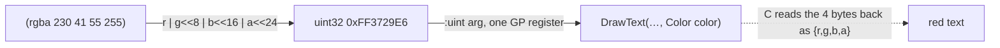

# `Color` passed by value, as a packed `:uint`

Every raylib draw call takes a `Color`. `Color` is a struct passed **by value**,
and Jolt's FFI (Chez `foreign-procedure`) has no calling convention for a by-value
struct. raylib gets away with it anyway, because `Color` is the one by-value struct
that reduces to a scalar the ABI *does* pass in a register.

## The ABI fact that makes it work

From raylib's `raylib.h`:

```c
typedef struct Color {
    unsigned char r, g, b, a;   // 4 bytes total
} Color;

void ClearBackground(Color color);
void DrawText(const char *text, int x, int y, int fontSize, Color color);
```

On both the AArch64 and x86-64 ABIs, a 4-byte struct made entirely of integers
travels in a **single general-purpose register**, bit-for-bit identical to how a
`uint32_t` travels. So a Jolt binding can declare the parameter as `:uint` and pass
an ordinary integer; the C side reads the same four bytes back as `{r,g,b,a}`. No
struct marshaling, no shim, no native allocation.

Contrast [`struct-by-value-pointer-trick.md`](struct-by-value-pointer-trick.md):
`Camera2D` is 24 bytes, too big for a register, so it needs the pointer approach.
`Color` is the easy case precisely because it fits in a register.

## The packing

`Color` is little-endian in memory: `r` at the lowest byte, then `g`, `b`, `a`. So
the `uint32` is `r | g<<8 | b<<16 | a<<24`. That is exactly `rgba`
(`lib/src/net/b12n/raylib/color.clj`):

```clojure
(defn rgba
  "Pack an RGBA color into the little-endian uint32 that raylib's `Color` struct
  is (r | g<<8 | b<<16 | a<<24), so it can cross the FFI boundary as a :uint."
  [r g b a]
  (bit-or (int r) (bit-shift-left (int g) 8)
          (bit-shift-left (int b) 16) (bit-shift-left (int a) 24)))
```

Every binding that takes a `Color` declares it `:uint`:

```clojure
(ffi/defcfn clear-background "ClearBackground" [:uint] :void)
(ffi/defcfn draw-text        "DrawText" [:string :int :int :int :uint] :void)
(ffi/defcfn draw-rectangle   "DrawRectangle" [:int :int :int :int :uint] :void)
```

The whole named palette is just `rgba` calls with the values from `raylib.h`:

```clojure
(def RAYWHITE (rgba 245 245 245 255))
(def RED      (rgba 230 41 55 255))
(def BLUE     (rgba 0 121 241 255))
;; … 25 named colors total
```



## Two by-value Colors in one call

`DrawRectangleGradientV` takes **two** `Color` values by value (top and bottom of
the gradient). Because each is an independent `:uint`, this needs nothing special,
just two `:uint` parameters:

```clojure
(ffi/defcfn draw-rectangle-grad-v "DrawRectangleGradientV"
  [:int :int :int :int :uint :uint] :void)   ; x y w h topColor bottomColor
```

The `gradient` example (`net.b12n.raylib-jlt.gradient`) uses it directly. Two by-value
structs in one signature would be a real problem if they didn't each collapse to a
register; this is a second dividend of the register-fit fact.

## Getting the color back out (for rlgl)

rlgl's immediate mode (see [`rlgl-immediate-mode.md`](rlgl-immediate-mode.md)) wants
the four components as separate `u8` args to `rlColor4ub`, not a packed int. So
`rl-color!` unpacks the same `:uint`, keeping one Color representation across the
whole API:

```clojure
(defn rl-color! [color]
  (rl-color-4ub (bit-and color 0xff)
                (bit-and (bit-shift-right color 8) 0xff)
                (bit-and (bit-shift-right color 16) 0xff)
                (bit-and (bit-shift-right color 24) 0xff)))
```

## Why this generalizes

Any Chez/Jolt FFI against a C library with a small all-integer by-value struct can
use this: pack the fields little-endian into the matching-width integer and bind the
parameter as that integer type. It works for structs up to 8 bytes (a register); the
moment the struct is >16 bytes or contains floats, the ABI stops passing it in a GP
register and you need [`struct-by-value-pointer-trick.md`](struct-by-value-pointer-trick.md)
(large structs) or [`rlgl-immediate-mode.md`](rlgl-immediate-mode.md) (float
structs).

## See also

- [`struct-by-value-pointer-trick.md`](struct-by-value-pointer-trick.md): the
  >16-byte case (`Camera2D`/`Camera3D`) that a register can't hold.
- `b12n-tsj` (the Jolt tree-sitter sibling, not yet public): its by-value struct
  (`TSNode`) is both large *and* returned, so no register trick saves it and it
  must ship a C shim.
