# Full-size demo gallery

Every example at full size, linked from
[the example catalog](example-catalog.md)'s preview thumbnails. All 187 are
here. 171 are animated GIFs from `bb record`; the other 16 are single still
frames, captured with the headless screenshot hook because they are newer than
the last recording pass. A still is one frame of a thing that usually moves, so
it shows what an example draws without showing what it does.

Most are animated. Some examples draw something fixed and only move once you
drive them, so their recording is a single frame, and that is the honest form
for those. `drop-files` is the clearest case, because it waits on a real file
drag that the capture tool cannot synthesize, so it shows the empty window it
starts in.

## games (11)

### asteroids

the classic vector shooter (rotate/thrust/fire)

### tetris

the block-stacking puzzle (move/rotate/drop)

### pong

two-paddle classic, you (W/S) vs a CPU

### vampire-survivors

auto-fire survival: move, waves chase you

### snake

the classic snake (arrow keys, grow, don't crash)

### breakout

paddle + ball + brick grid (mouse paddle)

### space-invaders

marching aliens (arrows + SPACE to shoot)

### flappy-bird

flap through the pipe gaps (SPACE)

### game-2048

2048: 4x4 tile-merge puzzle (arrow keys)

### minesweeper

reveal/flag grid (mouse L reveal, R flag)

### pacman

pac-man, with the classic ghost personalities

## core (34)

### basic-window

the minimal raylib window + text

### input-keys

steer a ball with the arrow keys

### input-mouse

a ball follows the mouse; click to recolor

### input-mouse-wheel

scroll a box with the mouse wheel

### camera-2d

a 2D camera over a skyline (struct-by-value)

### delta-time

per-frame vs delta-time movement

### scissor-test

a scissor rectangle clips a grid

### basic-screen-manager

a LOGO/TITLE/GAMEPLAY/ENDING flow

### random-values

a new random value every two seconds

### window-letterbox

a fixed picture letterboxed into the window

### window-flags

toggle vsync/resizable/topmost live

### monitor-detector

every attached display, current one lit

### clipboard-text

type, C copies, V pastes

### input-gamepad

sticks, triggers and buttons for pad 0

### input-multitouch

touch points (the mouse is point 0)

### input-virtual-controls

an on-screen D-pad and action button

### undo-redo

a bounded history, CTRL-Z and CTRL-Y walking it

### window-should-close

`SetExitKey` so a close request can be answered

### input-gestures

`GetGestureDetected`, named as they happen

### random-sequence

a shuffled sequence, each height used once

### camera-2d-mouse-zoom

zoom pinned to the point under the cursor

### storage-values

values that survive a restart, via a file

### camera-2d-platformer

five ways a camera can follow a jumping player

### camera-2d-split-screen

two players, two cameras, two render textures

### keyboard-testbed

an on-screen ENG-US keyboard, every key lit

### input-actions

abstract input actions: keyboard + gamepad

### smooth-pixelperfect

sub-pixel camera smoothing at 5x upscale

### viewport-scaling

6 viewport-scaling policies, resize live

### highdpi-testbed

diagnostic overlay: monitors, DPI, crosshair

### compute-hash

CRC32/MD5/SHA1/SHA256 + Base64 of typed text

### drop-files

drag files in: FilePathList by value

### directory-files

a file browser over LoadDirectoryFilesEx

### custom-logging

raylib's log captured by a jolt callback

### highdpi-demo

logical points vs physical pixels, two rulers

## shapes (45)
### bouncing-ball

a ball bouncing around the window

### basic-shapes

shape primitives + an rlgl triangle

### colors-palette

every named raylib color in a grid

### gradient

a vertical two-color gradient

### following-eyes

two eyes track the mouse

### starfield

a twinkling starfield

### logo-raylib

the raylib logo from rectangles + text

### mouse-trail

a fading trail follows the cursor

### recursive-tree

a binary fractal tree

### math-sine-cosine

a live unit-circle trig visualization

### bullet-hell

a rotating bullet spiral

### triangle-strip

a rainbow strip via rlgl immediate mode

### collision-area

AABB collision between two boxes

### dashed-line

a dashed line follows the mouse

### double-pendulum

chaotic double-pendulum motion + trail

### kaleidoscope

strokes mirrored with 6-fold symmetry

### hilbert-curve

a rainbow Hilbert space-filling curve

### math-angle-rotation

fixed spokes + a spinning line

### ball-physics

2D balls under gravity, SPACE respawns

### lines-bezier

a cubic Bézier that follows the mouse

### color-wheel

an HSV color wheel (rlgl triangle fan)

### pie-chart

labelled pie slices via rl/sector!

### splines

Catmull-Rom / Bezier / B-spline (SPACE cycles)

### vector-angle

the angle between two vectors (arc + readout)

### easings

a grid of balls, each on a different easing curve

### penrose-tiling

a P3 Penrose rhombus tiling (deflation)

### analog-clock

a live analog clock (libc local time)

### digital-clock

a seven-segment HH:MM:SS clock (libc time)

### ring-drawing

an animated annulus via rl/ring!

### rounded-rectangle

rounded rects via sector! corners

### rectangle-scaling

drag the corner handle to resize a rect

### lines-drawing

a rotating fan of thick lines (line-ex!)

### ellipse-collision

two ellipses reddening when they overlap

### rlgl-triangle

per-vertex colour interpolated across a face

### rlgl-color-wheel

a hue wheel as a triangle fan

### circle-sector-drawing

a sector starved of segments

### easings-rectangles

size and rotation on one easing curve

### easings-ball

slide, swell and fade, one curve each

### easings-box

drop, flatten, spin, grow, fade: five curves

### logo-anim

the raylib logo assembling itself, unsmoothed

### rectangle-advanced

per-side roundness with a horizontal gradient

### easings-testbed

one curve at a time, plotted and run

### starfield-effect

flying starfield (wheel=speed, SPACE=mode)

### top-down-lights

lights and shadow volumes in an alpha mask

### outlines-thickness

thick outlines, and what a negative one does

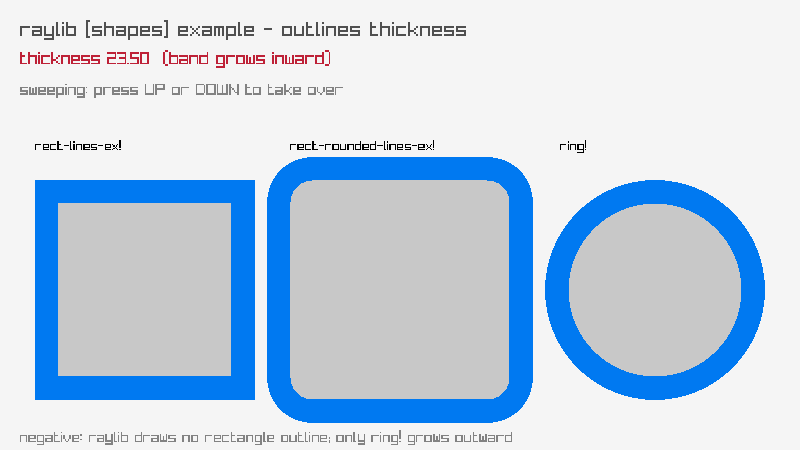

## text (8)

### font-sizes

font sizes + MeasureText centering

### writing-anim

a message types itself out

### format-text

padded score + MM:SS timer readouts

### words-alignment

align a word inside a box (MeasureText)

### input-box

type into a text box (GetCharPressed)

### rectangle-bounds

draggable word-wrap text container

### strings-management

bouncing text you slice, shatter and glue

### inline-styling

colour markup inside the string itself

## 3d (28)
### camera-3d

an orbiting 3D camera (Camera3D by value)

### waving-cubes

an NxN grid of cubes rippling in 3D

### camera-3d-first-person

walk a yard of columns in first person

### tesseract-view

a rotating 4D hypercube projected to 2D

### wireframe-shapes

pyramid/octahedron/torus/helix in 3D lines

### rlgl-solar-system

Sun/Earth/Moon via the rlgl matrix stack

### box-collisions

a player cube colliding with 3D boxes

### rotating-cube

a single cube spinning via the rlgl matrix stack

### spinning-cubes

a row of cubes each spinning with a phase offset

### orthographic-projection

perspective vs orthographic (SPACE toggles)

### point-cloud

~1500 points as tiny rlgl cubes, rotating

### bouncing-spheres

spheres bouncing in a 3D box (rl/sphere!)

### lorenz-attractor

the Lorenz attractor traced in 3D

### dna-helix

a turning double helix, coloured bases

### yaw-pitch-roll

the three aircraft rotations in 3D

### first-person-maze

walk a grid maze, with a minimap

### world-screen

a 2D label tracks a cube via GetWorldToScreen

### geometric-shapes

cubes, spheres, cylinders, cones, capsules

### camera-3d-split-screen

two players, two render-texture halves

### camera-3d-free

a free-look camera around a cube, UpdateCamera

### textured-cube

two cubes, one textured atlas, one sub-rect

### billboard-rendering

camera-facing quads, one spins

### directional-billboard

a billboard whose facing row turns with the camera

### helitorus

a helix wound around a torus, swept into a tube

### doom

a textured raycaster: one ray per screen column

### basic-voxel

an 8x8x8 voxel block, click one out

### picking-3d

click a box: a real GetScreenToWorldRay pick

### mesh-generation

eight GenMesh shapes, drawn with DrawMesh

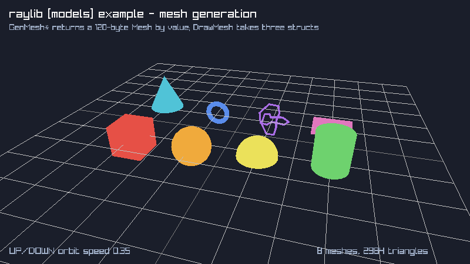

## generative (10)

### game-of-life

Conway's Game of Life (SPACE reseeds)

### boids

flocking birds (separation/alignment/cohesion)

### fireworks

rockets + fading particle bursts

### fourier-epicycles

rotating circles trace a square wave

### spirograph

animated hypotrochoid roulette curves

### l-system

an L-system fractal plant (grows + regrows)

### flow-field

particles steered by a flow field (trails)

### cellular-automata

Wolfram's elementary automata

### clock-of-clocks

six digits spelled by a grid of clock hands

### particles

water/smoke/fire particles follow the mouse

## textures (28)
### texture-procedural

four textures built pixel by pixel

### texture-tiling

one tile repeated across the window

### render-texture

a scene drawn off-screen, then reused

### bunnymark

the sprite-count benchmark (click to add)

### mouse-painting

a paint program on a render-texture canvas

### particles-blending

200 sparks trail the mouse, alpha vs additive

### polygon-drawing

hue-wheel texture on a spinning polygon

### srcrec-dstrec

srcrec picks the frame, dstrec scales+spins it

### blend-modes

four 2D blend modes over a night skyline

### screen-buffer

the classic DOS fire effect

### background-scrolling

three parallax skyline layers, each scrolling

### fog-of-war

fog lifted by a 25x15 render texture

### framebuffer-rendering

two cameras, two framebuffers, one scene

### image-generation

nine procedural textures, none of them loaded

### image-processing

nine CPU-side image operations, picked live

### image-kernel

sharpen, sobel and gaussian, one call each

### npatch-drawing

nine-patch stretching, corners held fixed

### sprite-button

one sheet, three states, sliced by v

### image-drawing

shapes baked once, then drawn live each frame

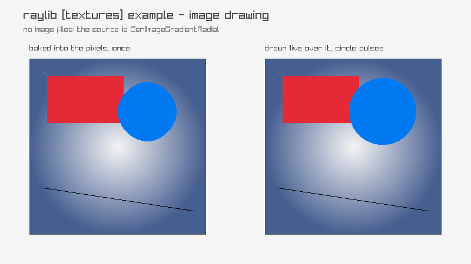

### image-text

text baked into the image, pixelates at 4x

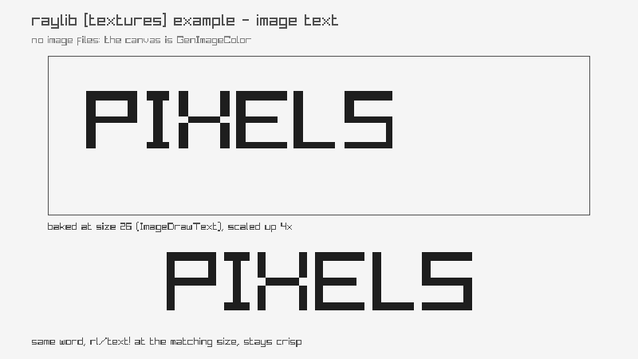

### image-rotate

0/90/180/270 exact, one angle grows the buffer

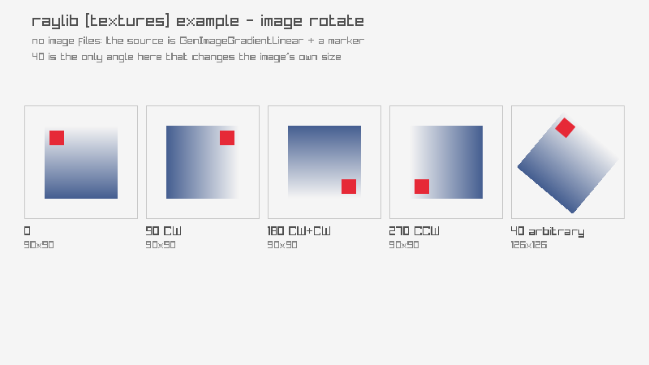

### image-channel

R/G/B/A split; alpha masked to show structure

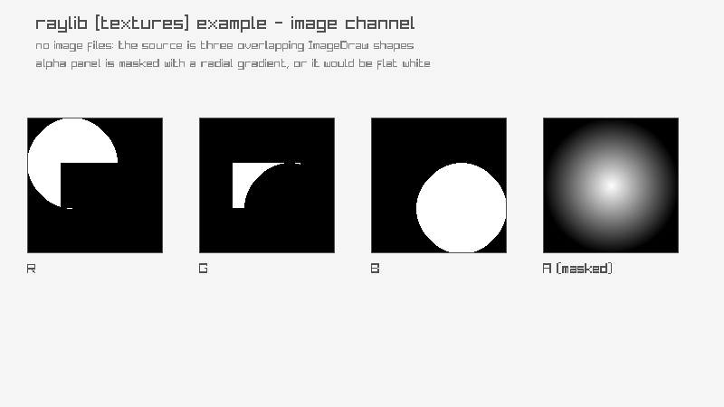

### sprite-stacking

40 generated slices faking a 3D car

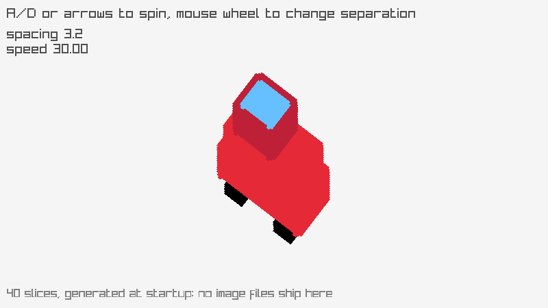

### to-image

one image, VRAM to RAM to VRAM and back up

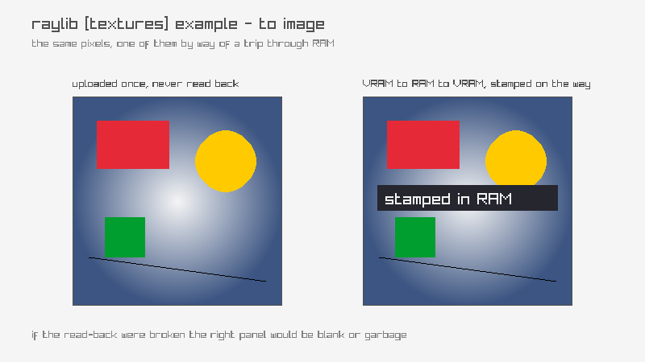

### raw-data

textures built from a hand-filled byte buffer

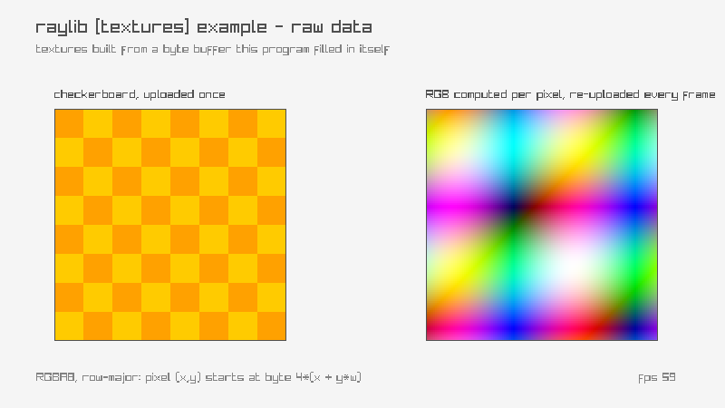

### sprite-animation

six generated poses, one source rectangle

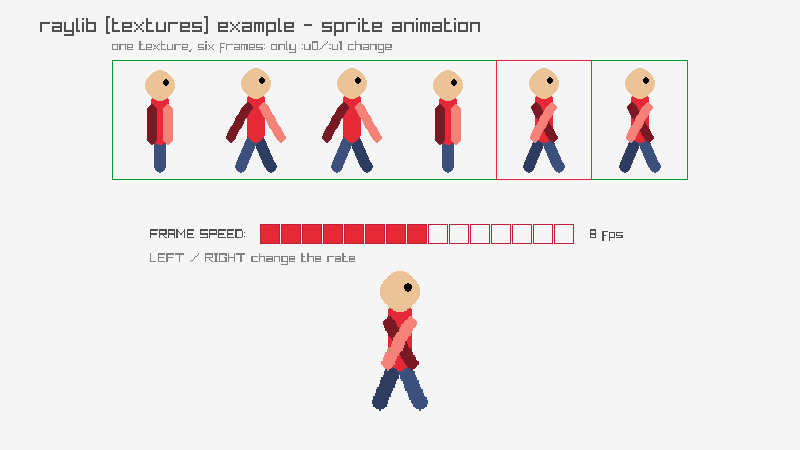

### magnifying-glass

a round lens that reveals hidden markers

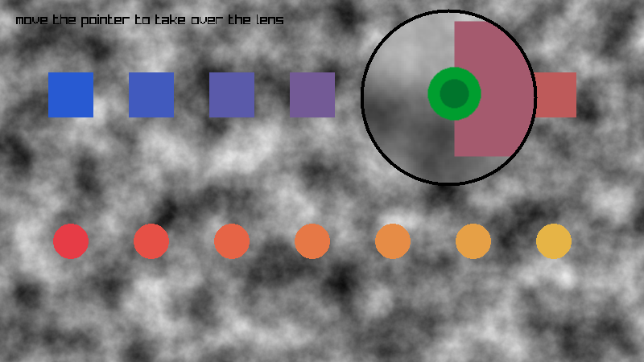

### textured-curve

a texture laid along a cubic Bezier

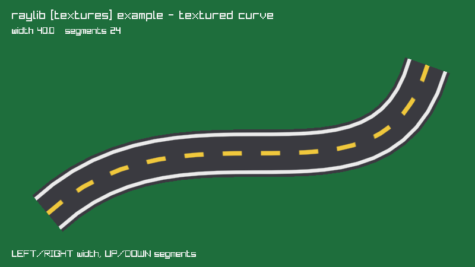

## shaders (20)
### julia-set

the Julia set, mouse-steered, in a shader

### mandelbrot-set

the Mandelbrot set, zoomable, in a shader

### raymarching

a raymarched SDF scene in a shader

### rounded-rect-shader

SDF rounded rects: fill, border, shadow

### palette-switch

bands recolored by an ivec3 palette

### shader-hot-reload

swap and recompile the GLSL at runtime

### postprocessing

post-process shaders cycled over a scene

### custom-uniform

a mouse-steered swirl over a scene

### texture-painting

a blank texture painted by a shader

### multi-sampler

two textures blended by a second sampler

### eratosthenes-sieve

the Sieve of Eratosthenes, one test per pixel

### texture-rendering

a grid of squares painted entirely by a shader

### texture-waves

a starfield rippled by a UV-displacement shader

### color-correction

contrast/saturation/brightness shader

### texture-outline

a shader outline around a sprite's alpha edge

### ascii-rendering

ascii art from a post-process shader

### basic-lighting

four point lights, custom vertex shader

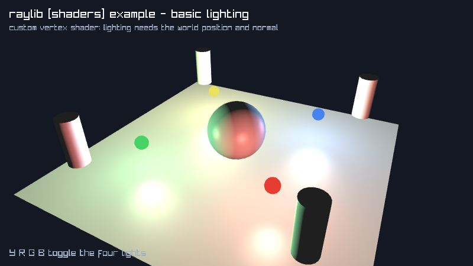

### fog-rendering

exponential distance fog in the light shader

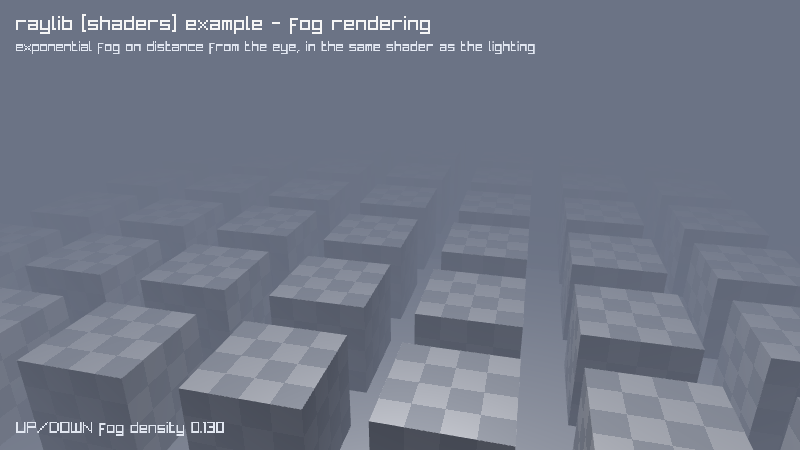

### mesh-instancing

10000 lit cubes in one draw call

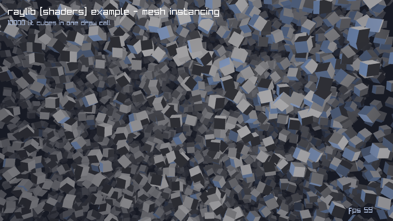

### vertex-displacement

a flat plane made terrain in the vertex stage

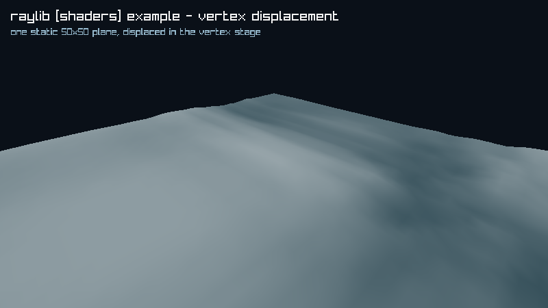

## audio (3)

### audio-raw-stream

arrow keys steer a live sine tone's pitch/pan

### amp-envelope

ADSR amplitude envelope on a 440Hz tone

### audio-stream-callback

raudio pulls samples from its own thread

