# The example catalog: 175 raylib demos in jolt

A map of the whole suite. Each example is one namespace under
`src/net/b12n/raylib_jlt/`, runnable by a friendly `bb <name>` task or the underlying
`jolt -M:<alias>`. `bb info` prints this grouping live; this page adds the "how it's
wired" recipe at the end.

Run one, list them, or reel through all of them:

```sh
bb <name>          # e.g. bb asteroids   (opens a window)
bb examples        # flat list with descriptions
bb info            # the grouped cheat-sheet below
bb run-all [secs]  # every example, N seconds each (unattended)
```

## games (11)

| preview | `bb` name | shows |
|---|---|---|
| [](demos.md#asteroids) | `asteroids` | the classic vector shooter, splitting rocks |
| [](demos.md#tetris) | `tetris` | 10×20 well, 7 tetrominoes, lines, levels |
| [](demos.md#pong) | `pong` | two-paddle classic, you (W/S) vs a CPU |
| [](demos.md#vampire-survivors) | `vampire-survivors` | auto-firing survivors-like: waves, XP, levels |
| [](demos.md#snake) | `snake` | the classic snake (arrow keys, grow, don't crash) |
| [](demos.md#breakout) | `breakout` | paddle + ball + brick grid (mouse paddle) |
| [](demos.md#space-invaders) | `space-invaders` | marching aliens (arrows + SPACE to shoot) |
| [](demos.md#flappy-bird) | `flappy-bird` | flap through the pipe gaps (SPACE) |
| [](demos.md#game-2048) | `game-2048` | 2048: 4x4 tile-merge puzzle (arrow keys) |
| [](demos.md#minesweeper) | `minesweeper` | reveal/flag grid (mouse L reveal, R flag) |
| [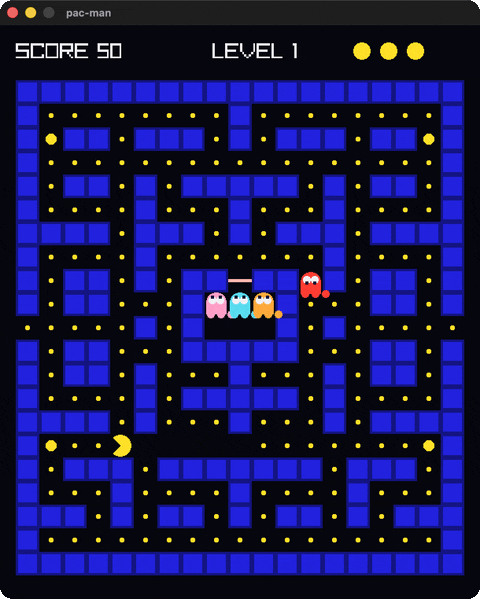](demos.md#pacman) | `pacman` | the four classic ghost personalities, buffered turns |

## core (34)

| preview | `bb` name | shows |
|---|---|---|
| [](demos.md#basic-window) | `basic-window` | the minimal window + text (`jolt -M:run`) |
| [](demos.md#input-keys) | `input-keys` | `IsKeyDown`, steer a ball with the arrow keys |
| [](demos.md#input-mouse) | `input-mouse` | `GetMouseX/Y` + click to recolor |
| [](demos.md#input-mouse-wheel) | `input-mouse-wheel` | `GetMouseWheelMove` scrolls a box |
| [](demos.md#camera-2d) | `camera-2d` | a 2D camera over a skyline (struct by value) |
| [](demos.md#delta-time) | `delta-time` | per-frame vs `GetFrameTime` movement |
| [](demos.md#scissor-test) | `scissor-test` | `BeginScissorMode` clips a grid |
| [](demos.md#basic-screen-manager) | `basic-screen-manager` | a LOGO / TITLE / GAMEPLAY / ENDING state flow |
| [](demos.md#random-values) | `random-values` | `GetRandomValue`, a new value every 2s |
| [](demos.md#window-letterbox) | `window-letterbox` | a fixed picture letterboxed into the window |
| [](demos.md#window-flags) | `window-flags` | toggle vsync/resizable/topmost live |
| [](demos.md#monitor-detector) | `monitor-detector` | every attached display, current one lit |
| [](demos.md#clipboard-text) | `clipboard-text` | type, C copies to the system clipboard, V pastes |
| [](demos.md#input-gamepad) | `input-gamepad` | live sticks, triggers and buttons for gamepad 0 |
| [](demos.md#input-multitouch) | `input-multitouch` | touch points (the mouse is point 0) |
| [](demos.md#input-virtual-controls) | `input-virtual-controls` | an on-screen D-pad and action button |
| [](demos.md#undo-redo) | `undo-redo` | a bounded history, CTRL-Z and CTRL-Y walking it |
| [](demos.md#window-should-close) | `window-should-close` | `SetExitKey` so a close request can be answered |
| [](demos.md#input-gestures) | `input-gestures` | `GetGestureDetected`, named as they happen |
| [](demos.md#random-sequence) | `random-sequence` | a shuffled sequence, each height used once |
| [](demos.md#camera-2d-mouse-zoom) | `camera-2d-mouse-zoom` | zoom pinned to the point under the cursor |
| [](demos.md#storage-values) | `storage-values` | values that survive a restart, via a file |
| [](demos.md#camera-2d-platformer) | `camera-2d-platformer` | five ways a camera can follow a jumping player |
| [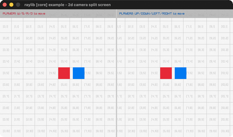](demos.md#camera-2d-split-screen) | `camera-2d-split-screen` | two players, two cameras, two render textures |
| [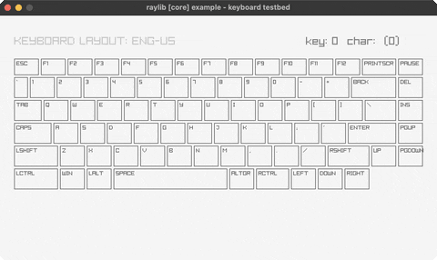](demos.md#keyboard-testbed) | `keyboard-testbed` | an on-screen ENG-US keyboard, every key lit |
| [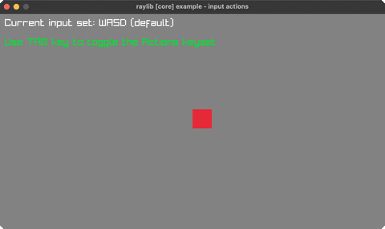](demos.md#input-actions) | `input-actions` | abstract input actions: keyboard + gamepad |
| [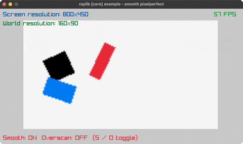](demos.md#smooth-pixelperfect) | `smooth-pixelperfect` | sub-pixel camera smoothing at 5x upscale |
| [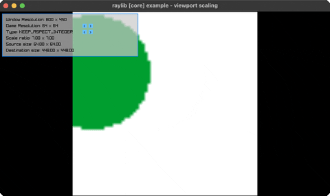](demos.md#viewport-scaling) | `viewport-scaling` | 6 viewport-scaling policies, resize live |
| [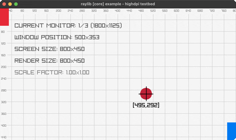](demos.md#highdpi-testbed) | `highdpi-testbed` | diagnostic overlay: monitors, DPI, crosshair |
| [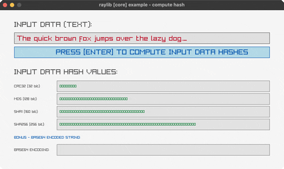](demos.md#compute-hash) | `compute-hash` | CRC32/MD5/SHA1/SHA256 + Base64 of typed text |
| [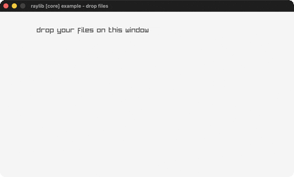](demos.md#drop-files) | `drop-files` | drag files in: FilePathList by value |
| [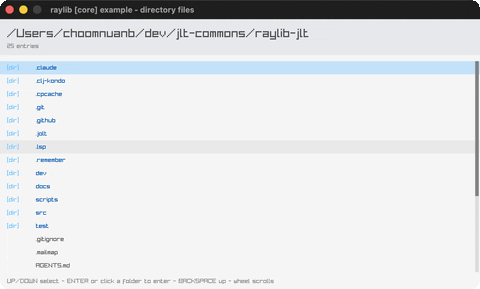](demos.md#directory-files) | `directory-files` | a file browser over LoadDirectoryFilesEx |
| [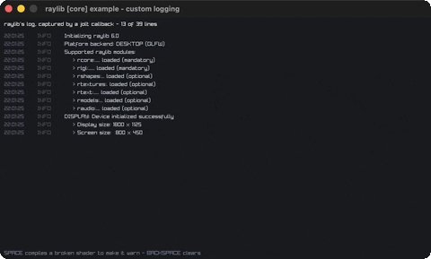](demos.md#custom-logging) | `custom-logging` | raylib's log captured by a jolt callback |
| [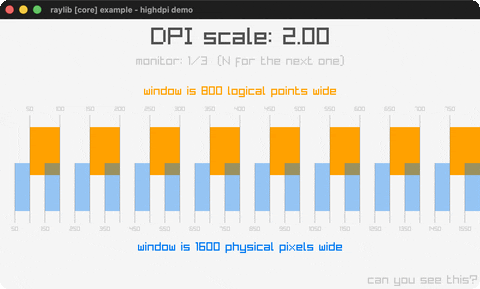](demos.md#highdpi-demo) | `highdpi-demo` | logical points vs physical pixels, two rulers |

## shapes (44)

| preview | `bb` name | shows |
|---|---|---|
| [](demos.md#bouncing-ball) | `bouncing-ball` | animation, `IsKeyPressed` pause, `DrawFPS` |
| [](demos.md#basic-shapes) | `basic-shapes` | rect / circle / ellipse / line + an rlgl triangle |
| [](demos.md#colors-palette) | `colors-palette` | every named raylib color in a grid |
| [](demos.md#gradient) | `gradient` | `DrawRectangleGradientV` (two by-value Colors) |
| [](demos.md#following-eyes) | `following-eyes` | pupils track the mouse (scalar trig) |
| [](demos.md#starfield) | `starfield` | `GetRandomValue` + bulk draw, per-star twinkle |
| [](demos.md#logo-raylib) | `logo-raylib` | rectangles + text, positioned with `MeasureText` |
| [](demos.md#mouse-trail) | `mouse-trail` | a fading cursor trail (alpha) |
| [](demos.md#recursive-tree) | `recursive-tree` | a binary fractal tree (lines + trig) |
| [](demos.md#math-sine-cosine) | `math-sine-cosine` | a live unit-circle sine/cosine visualization |
| [](demos.md#bullet-hell) | `bullet-hell` | a rotating bullet spiral |
| [](demos.md#triangle-strip) | `triangle-strip` | a rainbow strip via rlgl immediate mode |
| [](demos.md#collision-area) | `collision-area` | AABB collision between two boxes |
| [](demos.md#dashed-line) | `dashed-line` | a dashed line follows the mouse |
| [](demos.md#double-pendulum) | `double-pendulum` | chaotic double-pendulum motion + trail |
| [](demos.md#kaleidoscope) | `kaleidoscope` | strokes mirrored with 6-fold symmetry |
| [](demos.md#hilbert-curve) | `hilbert-curve` | a rainbow Hilbert space-filling curve |
| [](demos.md#math-angle-rotation) | `math-angle-rotation` | fixed spokes + a spinning line |
| [](demos.md#ball-physics) | `ball-physics` | 2D balls under gravity, SPACE respawns |
| [](demos.md#lines-bezier) | `lines-bezier` | a cubic Bézier that follows the mouse |
| [](demos.md#color-wheel) | `color-wheel` | an HSV wheel as an rlgl triangle fan |
| [](demos.md#pie-chart) | `pie-chart` | labelled pie slices via `rl/sector!` + a legend |
| [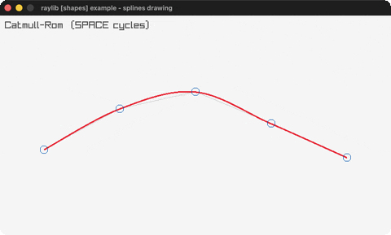](demos.md#splines) | `splines` | Catmull-Rom / Bézier / B-spline (SPACE cycles) |
| [](demos.md#vector-angle) | `vector-angle` | the signed angle between two vectors (`atan2`) |
| [](demos.md#easings) | `easings` | a grid of balls, each on a different easing |
| [](demos.md#penrose-tiling) | `penrose-tiling` | a P3 Penrose tiling by golden-ratio deflation |
| [](demos.md#analog-clock) | `analog-clock` | a live analog clock (libc local time) |
| [](demos.md#digital-clock) | `digital-clock` | a seven-segment `HH:MM:SS` display |
| [](demos.md#ring-drawing) | `ring-drawing` | an animated annulus via `rl/ring!` |
| [](demos.md#rounded-rectangle) | `rounded-rectangle` | rounded rects from `sector!` corners |
| [](demos.md#rectangle-scaling) | `rectangle-scaling` | drag the corner handle to resize a rect |
| [](demos.md#lines-drawing) | `lines-drawing` | a rotating fan of thick `rl/line-ex!` lines |
| [](demos.md#ellipse-collision) | `ellipse-collision` | two ellipses reddening when they overlap |
| [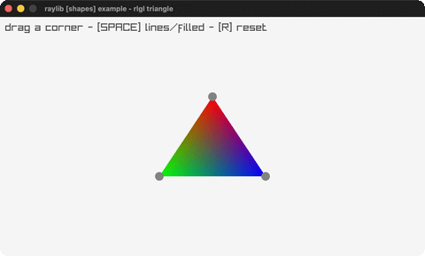](demos.md#rlgl-triangle) | `rlgl-triangle` | per-vertex colour interpolated across a face |
| [](demos.md#rlgl-color-wheel) | `rlgl-color-wheel` | a hue wheel as a triangle fan |
| [](demos.md#circle-sector-drawing) | `circle-sector-drawing` | a sector starved of segments |
| [](demos.md#easings-rectangles) | `easings-rectangles` | size and rotation on one easing curve |
| [](demos.md#easings-ball) | `easings-ball` | slide, swell and fade, one curve each |
| [](demos.md#easings-box) | `easings-box` | drop, flatten, spin, grow, fade: five curves |
| [](demos.md#logo-anim) | `logo-anim` | the raylib logo assembling itself, unsmoothed |
| [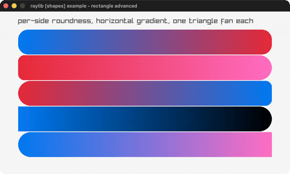](demos.md#rectangle-advanced) | `rectangle-advanced` | per-side roundness with a horizontal gradient |
| [](demos.md#easings-testbed) | `easings-testbed` | one curve at a time, plotted and run |
| [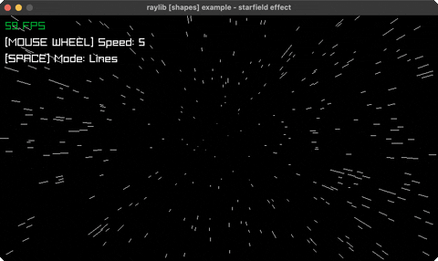](demos.md#starfield-effect) | `starfield-effect` | flying starfield (wheel=speed, SPACE=mode) |
| [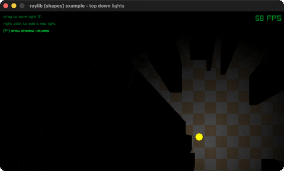](demos.md#top-down-lights) | `top-down-lights` | lights and shadow volumes in an alpha mask |

## text (8)

| preview | `bb` name | shows |
|---|---|---|
| [](demos.md#font-sizes) | `font-sizes` | font sizes + `MeasureText` centering |
| [](demos.md#writing-anim) | `writing-anim` | a self-typing message |
| [](demos.md#format-text) | `format-text` | `format` padded score + MM:SS timer |
| [](demos.md#words-alignment) | `words-alignment` | align a word inside a box with `MeasureText` |
| [](demos.md#input-box) | `input-box` | type into a text box (GetCharPressed) |
| [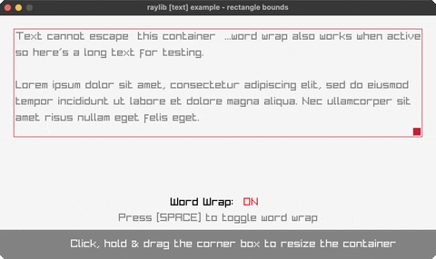](demos.md#rectangle-bounds) | `rectangle-bounds` | draggable word-wrap text container |
| [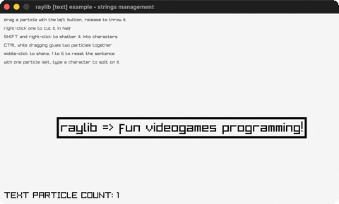](demos.md#strings-management) | `strings-management` | bouncing text you slice, shatter and glue |
| [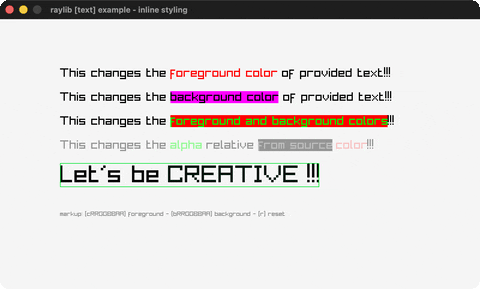](demos.md#inline-styling) | `inline-styling` | colour markup inside the string itself |

## 3d (27)

| preview | `bb` name | shows |
|---|---|---|
| [](demos.md#camera-3d) | `camera-3d` | an orbiting 3D camera, `Camera3D` by value |
| [](demos.md#waving-cubes) | `waving-cubes` | 196 cubes rippling in 3D (shared `rl/cube!`) |
| [](demos.md#camera-3d-first-person) | `camera-3d-first-person` | WASD + mouse-look walk through columns |
| [](demos.md#tesseract-view) | `tesseract-view` | a rotating 4D hypercube projected 4D→3D→2D |
| [](demos.md#wireframe-shapes) | `wireframe-shapes` | pyramid / torus / helix as rlgl 3D lines |
| [](demos.md#rlgl-solar-system) | `rlgl-solar-system` | Sun / Earth / Moon via the rlgl matrix stack |
| [](demos.md#box-collisions) | `box-collisions` | a player cube vs. boxes, 3D AABB highlight |
| [](demos.md#rotating-cube) | `rotating-cube` | a single cube spinning via the rlgl matrix stack |
| [](demos.md#spinning-cubes) | `spinning-cubes` | a row of cubes each spinning with a phase offset |
| [](demos.md#orthographic-projection) | `orthographic-projection` | perspective vs orthographic (SPACE toggles) |
| [](demos.md#point-cloud) | `point-cloud` | ~1500 points as tiny rlgl cubes, rotating |
| [](demos.md#bouncing-spheres) | `bouncing-spheres` | spheres bouncing in a 3D box (rl/sphere!) |
| [](demos.md#lorenz-attractor) | `lorenz-attractor` | the Lorenz attractor traced in 3D |
| [](demos.md#dna-helix) | `dna-helix` | a turning double helix with coloured base pairs |
| [](demos.md#yaw-pitch-roll) | `yaw-pitch-roll` | the three aircraft rotations in 3D |
| [](demos.md#first-person-maze) | `first-person-maze` | walk a grid maze in first person, with a minimap |
| [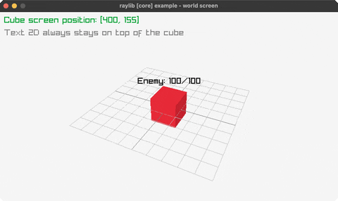](demos.md#world-screen) | `world-screen` | a 2D label tracks a cube via `GetWorldToScreen` |
| [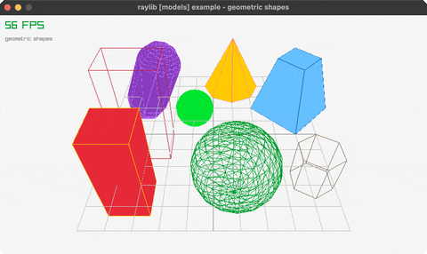](demos.md#geometric-shapes) | `geometric-shapes` | cubes, spheres, cylinders, cones, capsules |
| [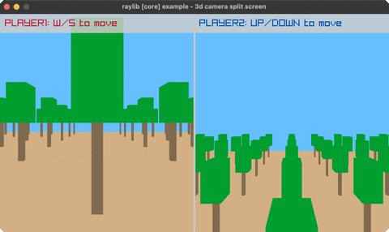](demos.md#camera-3d-split-screen) | `camera-3d-split-screen` | two players, two render-texture halves |
| [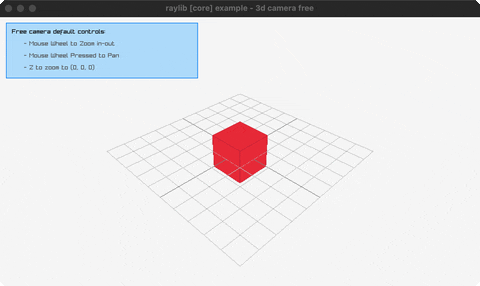](demos.md#camera-3d-free) | `camera-3d-free` | a free-look camera around a cube, UpdateCamera |
| [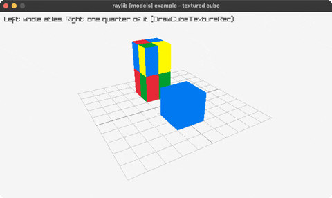](demos.md#textured-cube) | `textured-cube` | two cubes, one textured atlas, one sub-rect |
| [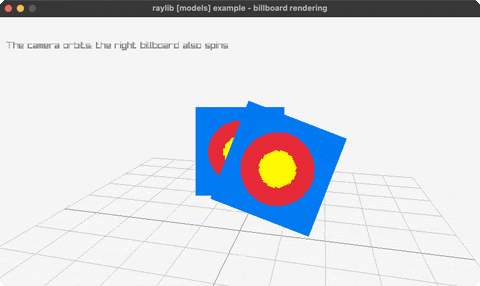](demos.md#billboard-rendering) | `billboard-rendering` | camera-facing quads, one spins |
| [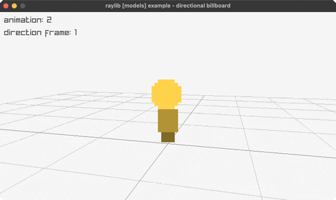](demos.md#directional-billboard) | `directional-billboard` | a billboard whose facing row turns with the camera |
| [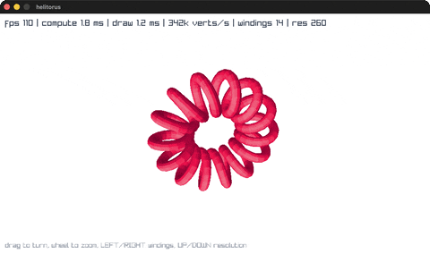](demos.md#helitorus) | `helitorus` | a helix wound around a torus, projected and depth-sorted in jolt |
| [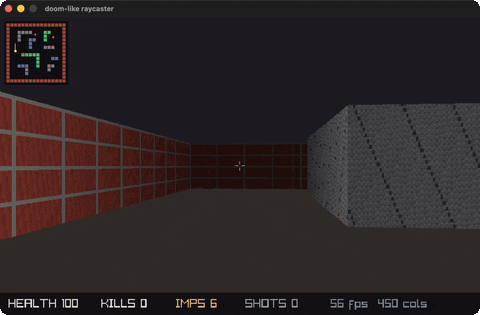](demos.md#doom) | `doom` | a textured raycaster: one ray per screen column, no 3D geometry |
| [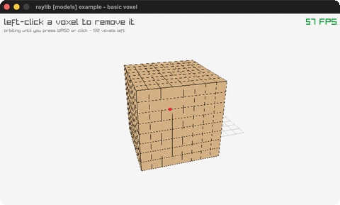](demos.md#basic-voxel) | `basic-voxel` | an 8x8x8 voxel block, click one out |
| [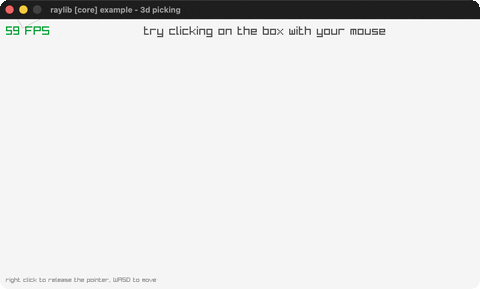](demos.md#picking-3d) | `picking-3d` | click a box: a real GetScreenToWorldRay pick |

Most of the 3D set stands on two building blocks from
[`rlgl-immediate-mode.md`](rlgl-immediate-mode.md) and
[`struct-by-value-pointer-trick.md`](struct-by-value-pointer-trick.md): `with-camera-3d`
(the camera, by pointer) and `cube!` (the geometry, by rlgl vertices).

`helitorus` and `doom` are the two that don't, and that is why they're worth
reading next to the others. `helitorus` does projection, lighting and
hidden-surface removal itself, so it shows how far the rlgl layer alone reaches
without a `Camera3D`. `doom` casts one ray per screen column and draws each hit as
a textured vertical strip, with no 3D geometry and no camera matrix anywhere; put
it beside `first-person-maze`, which walks a grid of real cubes under a
`Camera3D`, and the two techniques for the same picture sit side by side.

## generative (10)

| preview | `bb` name | shows |
|---|---|---|
| [](demos.md#game-of-life) | `game-of-life` | Conway's Game of Life (SPACE reseeds) |
| [](demos.md#boids) | `boids` | flocking birds (separation/alignment/cohesion) |
| [](demos.md#fireworks) | `fireworks` | rockets + fading particle bursts |
| [](demos.md#fourier-epicycles) | `fourier-epicycles` | rotating circles trace a square wave |
| [](demos.md#spirograph) | `spirograph` | animated hypotrochoid roulette curves |
| [](demos.md#l-system) | `l-system` | an L-system fractal plant (grows + regrows) |
| [](demos.md#flow-field) | `flow-field` | particles steered by a flow field (trails) |
| [](demos.md#cellular-automata) | `cellular-automata` | Wolfram's elementary automata |
| [](demos.md#clock-of-clocks) | `clock-of-clocks` | six digits spelled by a grid of clock hands |
| [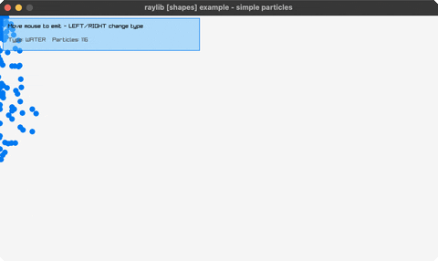](demos.md#particles) | `particles` | water/smoke/fire particles follow the mouse |

All nine are pure math + the drawing API, no new bindings. They showcase the
suite as a generative-art canvas: cellular automata, agent flocking, particle
systems, rotating-vector Fourier series, parametric roulette curves, string-rewrite
fractals, and noise-steered flow fields.

## textures (26)

raylib's texture API returns structs by value and has no binding here; these go
through rlgl's scalar layer instead, so every texture is built pixel by pixel in
native memory rather than loaded from a file. See
[`textures-via-rlgl.md`](textures-via-rlgl.md).

| preview | `bb` name | shows |
|---|---|---|
| [](demos.md#texture-procedural) | `texture-procedural` | four textures built pixel by pixel |
| [](demos.md#texture-tiling) | `texture-tiling` | one tile repeated across the window |
| [](demos.md#render-texture) | `render-texture` | a scene drawn off-screen, then reused |
| [](demos.md#bunnymark) | `bunnymark` | the sprite-count benchmark (click to add) |
| [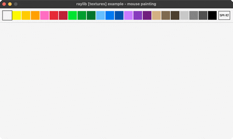](demos.md#mouse-painting) | `mouse-painting` | a paint program on a render-texture canvas |
| [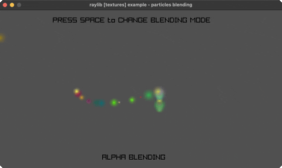](demos.md#particles-blending) | `particles-blending` | 200 sparks trail the mouse, alpha vs additive |
| [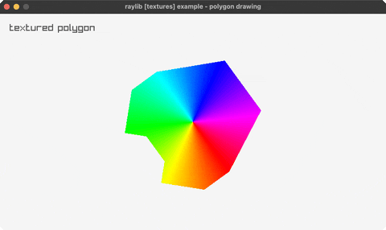](demos.md#polygon-drawing) | `polygon-drawing` | hue-wheel texture on a spinning polygon |
| [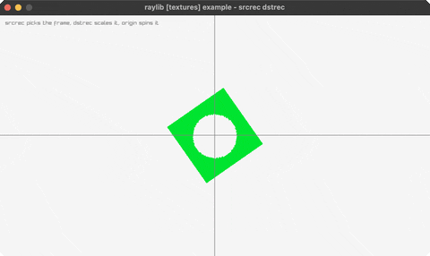](demos.md#srcrec-dstrec) | `srcrec-dstrec` | srcrec picks the frame, dstrec scales+spins it |
| [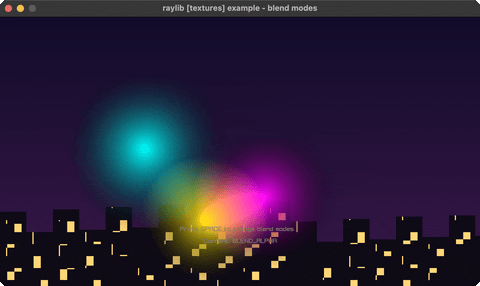](demos.md#blend-modes) | `blend-modes` | four 2D blend modes over a night skyline |
| [](demos.md#screen-buffer) | `screen-buffer` | the classic DOS fire effect |
| [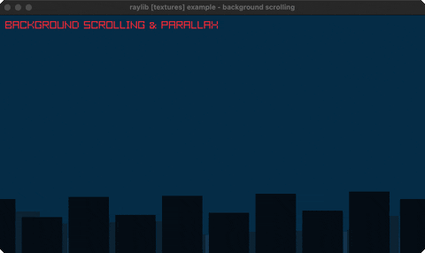](demos.md#background-scrolling) | `background-scrolling` | three parallax skyline layers, each scrolling |
| [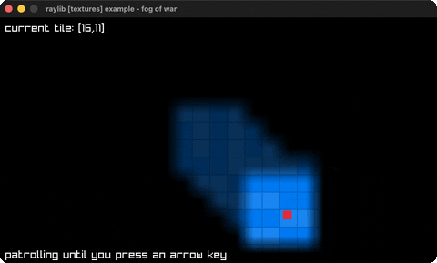](demos.md#fog-of-war) | `fog-of-war` | fog lifted by a 25x15 render texture |
| [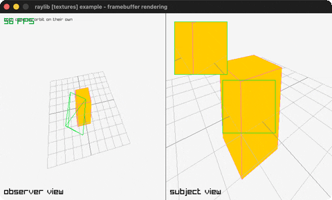](demos.md#framebuffer-rendering) | `framebuffer-rendering` | two cameras, two framebuffers, one scene |
| [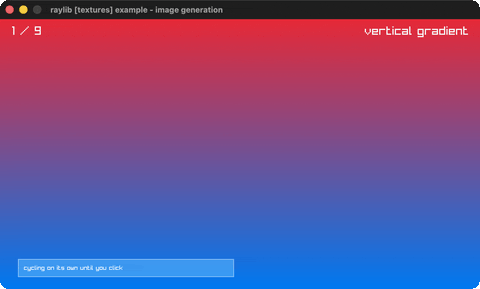](demos.md#image-generation) | `image-generation` | nine procedural textures, none of them loaded |
| [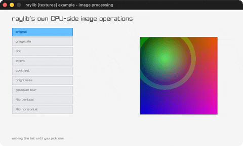](demos.md#image-processing) | `image-processing` | nine CPU-side image operations, picked live |
| [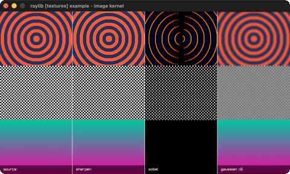](demos.md#image-kernel) | `image-kernel` | sharpen, sobel and gaussian, one call each |
| *not recorded yet* | `image-drawing` | shapes baked once, then drawn live each frame |
| *not recorded yet* | `image-text` | text baked into the image, pixelates at 4x |
| *not recorded yet* | `image-rotate` | 0/90/180/270 exact, one angle grows the buffer |
| *not recorded yet* | `image-channel` | R/G/B/A split; alpha masked to show structure |
| [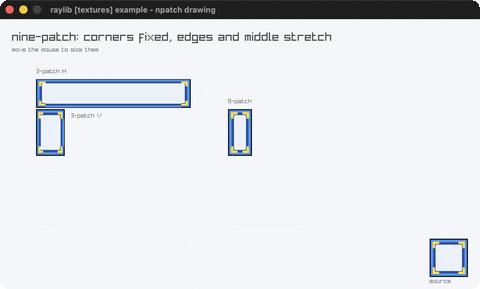](demos.md#npatch-drawing) | `npatch-drawing` | nine-patch stretching, corners held fixed |
| [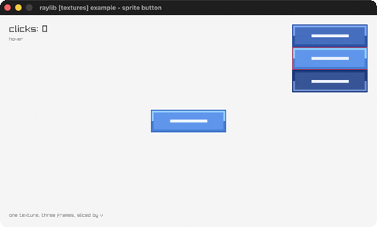](demos.md#sprite-button) | `sprite-button` | one sheet, three states, sliced by v |
| *not recorded yet* | `sprite-stacking` | 40 generated slices faking a 3D car |
| *not recorded yet* | `to-image` | one image, VRAM to RAM to VRAM and back up |
| *not recorded yet* | `raw-data` | textures built from a hand-filled byte buffer |
| *not recorded yet* | `sprite-animation` | six generated poses, one source rectangle |

## shaders (16)

GLSL compiled at runtime and run over a full-screen quad. raylib's `LoadShader`
returns a `Shader` by value, which needed jolt's `[:by-value [:struct ...]]` -
so these were the first examples to put a hard jolt floor under the suite, at
0.7.23. The floor is higher now, 0.8.0, for an unrelated `ffi/write` change the
[README](../../README.md#jolt) explains. The source
lives as a string in each namespace rather than a `.glsl` file, so an example
stays one self-contained file.

That `[:by-value ...]` support also supersedes the workarounds described in
[`textures-via-rlgl.md`](textures-via-rlgl.md) and
[`struct-by-value-pointer-trick.md`](struct-by-value-pointer-trick.md); those
pages still describe what the suite currently does elsewhere. A page on the
by-value API itself is not written yet.

| preview | `bb` name | shows |
|---|---|---|
| [](demos.md#julia-set) | `julia-set` | the Julia set, mouse-steered, in a shader |
| [](demos.md#mandelbrot-set) | `mandelbrot-set` | the Mandelbrot set, zoomable, in a shader |
| [](demos.md#raymarching) | `raymarching` | a raymarched SDF scene in a shader |
| [](demos.md#rounded-rect-shader) | `rounded-rect-shader` | SDF rounded rects: fill, border, shadow |
| [](demos.md#palette-switch) | `palette-switch` | bands recolored by an ivec3 palette |
| [](demos.md#shader-hot-reload) | `shader-hot-reload` | swap and recompile the GLSL at runtime |
| [](demos.md#postprocessing) | `postprocessing` | post-process shaders cycled over a scene |
| [](demos.md#custom-uniform) | `custom-uniform` | a mouse-steered swirl over a scene |
| [](demos.md#texture-painting) | `texture-painting` | a blank texture painted by a shader |
| [](demos.md#multi-sampler) | `multi-sampler` | two textures blended by a second sampler |
| [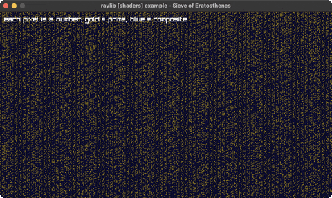](demos.md#eratosthenes-sieve) | `eratosthenes-sieve` | the Sieve of Eratosthenes, one test per pixel |
| [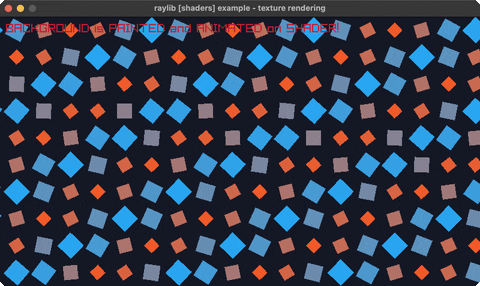](demos.md#texture-rendering) | `texture-rendering` | a grid of squares painted entirely by a shader |
| [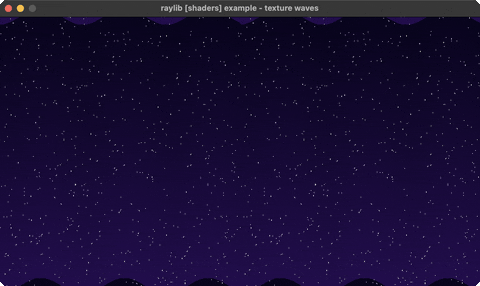](demos.md#texture-waves) | `texture-waves` | a starfield rippled by a UV-displacement shader |
| [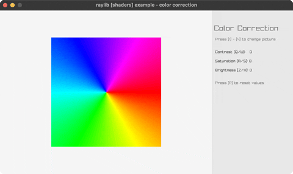](demos.md#color-correction) | `color-correction` | contrast/saturation/brightness shader |
| [](demos.md#texture-outline) | `texture-outline` | a shader outline around a sprite's alpha edge |
| [](demos.md#ascii-rendering) | `ascii-rendering` | ascii art from a post-process shader |

## audio (3)

raylib's raudio, in both directions. Two examples push, refilling a
caller-managed ring buffer every frame with `IsAudioStreamProcessed` /
`UpdateAudioStream`. The third lets raudio pull, from its own audio thread,
through a jolt callback. None of them loads a file, so there is no `LoadSound`
here yet.

| preview | `bb` name | shows |
|---|---|---|
| [](demos.md#audio-raw-stream) | `audio-raw-stream` | arrow keys steer a live sine tone's pitch/pan |
| [](demos.md#amp-envelope) | `amp-envelope` | ADSR amplitude envelope on a 440Hz tone |
| [](demos.md#audio-stream-callback) | `audio-stream-callback` | raudio pulls samples from its own thread |

## Adding an example: the five touchpoints

The suite is deliberately mechanical to grow. One new example touches five places:

1. **Source**: `src/net/b12n/raylib_jlt/<name>.clj`, a namespace with a `-main` that
   runs the canonical loop (see [`headless-smoke-testing.md`](headless-smoke-testing.md))
   against the `net.b12n.raylib.all` API.
2. **`deps.edn` alias**: `:<name> {:main-opts ["-m" "net.b12n.raylib-jlt.<name>"]}` so
   `jolt -M:<name>` works.
3. **`check.clj` require**: add `net.b12n.raylib-jlt.<name>` to the `:require` list in
   `net.b12n.raylib-jlt.check`, so the headless compile-check covers it.
4. **Registry row**: add `["<display-name>" "<alias>" "<group>" "<desc>"]` to the
   `examples` vector in [`scripts/examples_registry.clj`](../../scripts/examples_registry.clj),
   the single source of truth that `bb.edn` and the demo recorder both read.
5. **`bb.edn` task**: add a matching `<name> {:doc "..." :task (run-example "<name>")}`
   row, so `bb <name>` works alongside `bb info` / `bb examples` / `bb run-all`.

`bb check:registration` verifies all five without needing jolt or libraylib, and
CI runs it before the compile gate. Touchpoint 3 is why it exists: `bb check`
compiles what `check.clj` requires, so an example missing from that list is
never compiled and the run still reports success.

Note that the alias is not always the display name, and the namespace is
derivable from neither. `["basic-window" "run" ...]` reaches
`net.b12n.raylib-jlt.core` through the `:run` alias, and twelve rows differ this
way, so `deps.edn` is the source of truth for which namespace a row means.

A new group needs two more edits: the group list in `bb.edn`'s `info` task and the
`:groups` vector in `scripts/demo_manifest.edn`.


Filenames use underscores (`basic_screen_manager.clj`); the namespace uses hyphens
(`net.b12n.raylib-jlt.basic-screen-manager`), Clojure's standard file↔ns mapping.

One ordering rule applies inside every file: since **jolt 0.4.0** an unresolved
symbol is a compile error rather than a late-bound reference, so a definition must
appear before its first use, in a fn body and in an `:or` destructuring default
just as much as at top level. It bites hardest in the library's modules under
`lib/src/net/b12n/raylib/`, where one misordered symbol stops that module
compiling and, because every example requires `net.b12n.raylib.all`, *every*
example along with it. Only the first offender is reported. `bb check:lib`
and `jolt -M:check` are the quick confirmation; see the
[jolt note in the README](../../README.md#requirements).

## See also

- [`kwarg-drawing-api.md`](kwarg-drawing-api.md): the API every example is written
  against.
- [`headless-smoke-testing.md`](headless-smoke-testing.md): the loop shape and how
  `bb run-all` / `bb check` verify the catalog.
