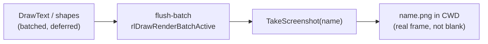

# Headless smoke testing: proving a window rendered with no one watching

A raylib example opens a window and runs until you close it. That's fine for a human,
useless for CI or an agent: nothing here can click a close button, and a test that
blocks forever is worse than no test. Two environment variables turn every windowed
example into something a machine can drive and verify, without changing a line of
the example itself.

## The two knobs

Both are read in `net.b12n.raylib-jlt.raylib` and consumed by the shared loop guards, so
every example inherits them for free.

- **`RAYLIB_APP_AUTO_QUIT_MS=<n>`**: close the window after `n` milliseconds. The
  example runs, renders real frames, then exits on its own.
- **`RAYLIB_APP_SHOT=<name>`**: dump one frame to a PNG. Headless *visual* proof
  that a frame actually rendered, not just that the process didn't crash.

## Auto-quit: a deadline the loop checks

`auto-quit-deadline` turns the env var into an absolute wall-clock deadline (or
`nil`); `keep-running?` ANDs it with raylib's own close signal:

```clojure
;; src/net/b12n/raylib_jlt/raylib.clj
(defn auto-quit-deadline []
  (when-let [v (System/getenv "RAYLIB_APP_AUTO_QUIT_MS")]
    (try (let [ms (Integer/parseInt v)]
           (when (pos? ms) (+ (System/currentTimeMillis) ms)))
         (catch Exception _ nil))))

(defn keep-running? [deadline]
  (and (not (window-should-close?))
       (or (nil? deadline) (< (System/currentTimeMillis) deadline))))
```

With the var unset, `deadline` is `nil` and `keep-running?` reduces to "while the
window is open", normal interactive behavior. Set it, and the loop ends on its own.

## The canonical loop

Every example is the same shape (`net.b12n.raylib-jlt.core`, the basic window):

```clojure
(defn -main [& _]
  (rl/window! :width 800 :height 450 :title "raylib [core] example - basic window")
  (rl/set-target-fps 60)
  (let [deadline (rl/auto-quit-deadline)]
    (loop [frame 0]
      (when (rl/keep-running? deadline)
        (rl/begin-drawing)
        (rl/clear-background rl/RAYWHITE)
        (rl/text! "Congrats! You created your first window!" :x 190 :y 200 …)
        (rl/maybe-screenshot! frame 10)
        (rl/end-drawing)
        (recur (inc frame)))))
  (rl/close-window))
```

`frame` is threaded through the loop so `maybe-screenshot!` can fire on a specific
frame (here frame 10, a few frames in, so the first render has settled).

## Screenshot: flush the batch first, or you get an empty PNG

The subtle part. raylib **batches** geometry (`DrawText`, shapes, everything) and
doesn't actually submit it to the framebuffer until `EndDrawing`. A naive
`TakeScreenshot` mid-frame would capture the framebuffer *before* this frame's
geometry lands, producing a blank or stale image. `maybe-screenshot!` flushes the
active render batch first:

```clojure
(defn maybe-screenshot! [frame at]
  (when (and shot-path (= frame at))
    (flush-batch)                 ; rlDrawRenderBatchActive, submit deferred geometry
    (take-screenshot shot-path)
    (binding [*out* *err*] (println "[net.b12n.raylib-jlt] SHOT" shot-path))))
```

Note: raylib writes the file's **basename into the current working directory**, it
ignores any directory component of the path. So `RAYLIB_APP_SHOT=out/x.png` still
writes `x.png` in CWD. Plan for that when collecting artifacts.



## Driving it

One example, auto-quit + shot:

```sh
RAYLIB_APP_AUTO_QUIT_MS=2000 RAYLIB_APP_SHOT=shot.png jolt -M:run
# opens, renders ~2s, writes shot.png, exits
```

The whole suite as a demo reel / smoke test: `bb run-all` sets
`RAYLIB_APP_AUTO_QUIT_MS` per example so each runs N seconds then advances:

```sh
bb run-all 3     # every example, 3s each, unattended
```

And the display-free check that belongs in CI: it compiles every example namespace
without opening a window at all:

```sh
jolt -M:check   # "net.b12n.raylib-jlt: all example namespaces compiled OK"
bb check         # same, via babashka
```

## One environment caveat

The screenshot path needs an **active display**: raylib/GLFW initializes a real GL
context. On a Mac whose display has slept, window creation can fail with "Failed to
determine Monitor" and then crash. `jolt -M:check` needs no display and always
works; `RAYLIB_APP_SHOT` needs a live (awake) display.

Worth knowing what that failure looks like, because it does not look like itself.
raylib prints `WARNING: SYSTEM: Failed to initialize platform` and keeps going, so
every call after it runs against an uninitialized platform and the process dies on
the way out with `Unhandled exception (RuntimeException): invalid memory
reference`, its trace pointing at whatever line happened to be last. That reads as
a bug in the example you just wrote. It is not: it hits every example at once, so
the check is to re-run one that already worked, say `jolt -M:run`, and look for
`INFO: DISPLAY: Device initialized successfully`. If that line is missing too, the
display is the problem and nothing in the source is.

## A C-truthiness footnote

raylib's boolean-returning functions (`WindowShouldClose`, `IsKeyDown`) return a
C `int` whose truth lives in the **low byte**; the upper bytes are unspecified. The
predicates mask before testing so a dirty high byte can't read as "true":

```clojure
(defn window-should-close? [] (not (zero? (bit-and (should-close-raw) 0xff))))
(defn key-down? [k] (not (zero? (bit-and (key-down-raw k) 0xff))))
```

## See also

- [`example-catalog.md`](example-catalog.md): every example inherits these guards
  through the shared loop shape.
- [`kwarg-drawing-api.md`](kwarg-drawing-api.md): the `rl/*!` calls inside the loop.
