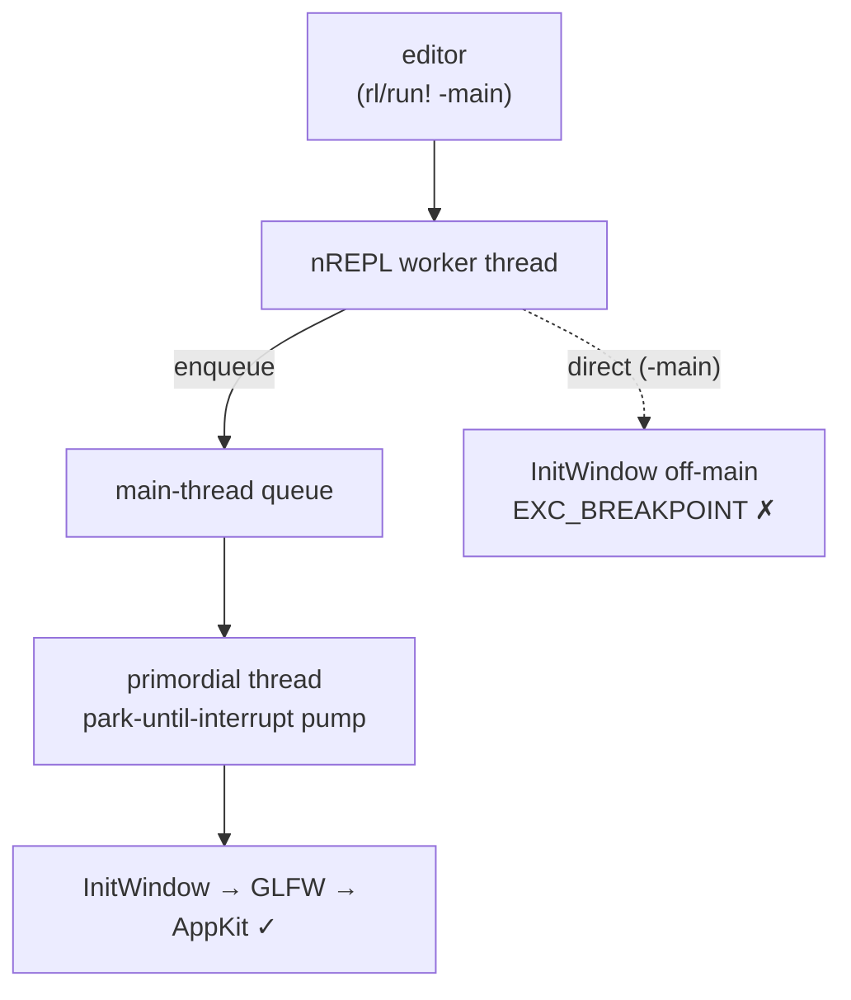

# REPL-driven development: why `(-main)` kills your editor connection

Connect an editor to `bb nrepl`, evaluate the buffer, then evaluate `(-main)` to see
the window. On macOS the whole thing dies:

```
[nREPL] Connection closed unexpectedly (connection broken by remote peer)
```

No Clojure exception, no stack trace, nothing in the REPL buffer. The message is
literal: the process on the other end stopped existing mid-sentence, so the socket
went with it. This page explains why, and gives you the one call that fixes it.

## The cause: raylib's window belongs to the main thread

macOS only lets `NSApplication` initialize on the **process main thread**. An nREPL
eval does not run there. The server accepts connections on a background thread and
hands each evaluation to a worker, so `InitWindow` reaches AppKit from the wrong
thread and AppKit traps the process outright.

The crash report (`~/Library/Logs/DiagnosticReports/jolt-*.ips`) shows it exactly.
Read it bottom-up:

```
AppKit                 NSUpdateCycleInitialize
AppKit                 -[NSApplication run]
libraylib.6.0.0.dylib  _glfwInitCocoa
libraylib.6.0.0.dylib  glfwInit
libraylib.6.0.0.dylib  InitPlatform
libraylib.6.0.0.dylib  InitWindow
jolt                   Scall0
jolt                   start_thread          <-- a spawned thread, not the main one
libsystem_pthread      _pthread_start
```

`EXC_BREAKPOINT (SIGTRAP)`. This is a trap inside AppKit, not a Clojure error, which
is why nothing catches it and why the REPL has nothing to print. The last thing the
server logs is raylib's own banner, stopping right where GLFW reaches Cocoa:

```
INFO: Initializing raylib 6.0
INFO: Platform backend: DESKTOP (GLFW)
INFO: Supported raylib modules:
INFO:     > rcore:..... loaded (mandatory)
...
INFO:     > raudio:.... loaded (optional)
                            <-- process gone
```

## The fix: `rl/run!`

```clojure
(comment
  (rl/run! -main))
```

That is the whole change. Every example's `(comment ...)` block should start it this
way rather than with a bare `(-main)`.

`run!` hops the call onto the main thread:

```clojure
;; lib/src/net/b12n/raylib/core.clj
(defn run! [f]
  (jolt.host/call-on-main-thread-async f))
```

Under `jolt nrepl-server` the primordial thread parks in `jolt.host/park-until-interrupt`,
which doubles as a **main-thread pump**. `call-on-main-thread-async` enqueues the
thunk onto that pump, so the window opens on the thread macOS insists on.



The same call is correct outside the REPL. With no pump running, which is what
`bb bounce` and `jolt -M:bounce` do, `call-on-main-thread-async` invokes the thunk
**inline** on the caller's thread, which is already the main one. So wrapping an
example's entry point costs nothing in the normal run path.

## Blocking or not

There are two variants and they differ only in who waits.

| call | the eval returns | REPL while the window is open |
| --- | --- | --- |
| `rl/run!` (`call-on-main-thread-async`) | immediately | free |
| `jolt.host/call-on-main-thread` | when the window closes | blocked until then |

`rl/run!` uses the async one, because a render loop runs until you close the window
and there is no reason to hold an editor connection hostage for that. Reach for the
blocking form only when you want the eval's return value to mean "the window is
closed", such as in a script.

## What actually works while a window is up

Measured on macOS 26 (Darwin 25.5), jolt 0.7.28, raylib 6.0, against `bounce`:

- **The REPL keeps answering.** Evaluations return normally while the loop renders.
- **The running loop picks up redefined vars.** Redefine a function the frame loop
  calls, and the next frame calls the new one. A counter wired into a per-frame
  function through a redefinition went 0 → 5 → 15 across three reads with the window
  still open. This is ordinary var indirection: the loop resolves the var each
  frame rather than capturing the function value once.

That second point is the interesting one, because it is what makes this a real
interactive loop rather than just a way to launch a window. Tweak a drawing function,
re-evaluate it, watch the running window change.

## What not to do from the REPL

**Don't call raylib drawing, lifecycle, or resource functions directly from an
evaluation.** Those belong to whichever thread owns the window. `rl/run!` exists to
move *entry* onto that thread; it does not make every later `rl/circle!` safe to fire
from a worker. Change what the loop draws by redefining the function it calls, and
let the loop make the call.

The same conclusion was reached independently on Linux, in
[jasalt/raylib-jlt's nREPL report](https://github.com/jasalt/raylib-jlt/blob/main/nrepl-results/REPORT.md)
(Fedora 44, jolt 0.7.27, raylib 6.0, under Xvfb): pure var redefinition is safe
provided the render loop dereferences vars dynamically, while drawing and lifecycle
calls must stay on a single owner thread, with anything else routed through an
application-owned queue.

The platforms differ in how loudly they say so. On macOS the very first `InitWindow`
from a worker is fatal and immediate, because AppKit checks. Elsewhere the same rule
holds but breaking it degrades rather than traps, which makes it easier to get away
with by accident and harder to debug later. Write it the safe way on every platform.

## Debugging the next one of these

When a jolt REPL disappears with no Clojure stack trace, it is a native crash, not an
evaluation error, and the evidence is outside the REPL:

```sh
# the crash report for the process that just vanished
ls -t ~/Library/Logs/DiagnosticReports/jolt-*.ips | head -1
```

The frames at the bottom of the triggered thread tell you which thread you were on:
`start_thread` means a spawned one, and anything touching AppKit from there is the
bug. The server's own stdout is the other half, since it shows how far raylib got
before the process died.

## See also

- [`headless-smoke-testing.md`](headless-smoke-testing.md): `RAYLIB_APP_AUTO_QUIT_MS`
  closes the window on a timer, which is handy from the REPL too when you would
  rather not reach for the mouse.
- [`example-catalog.md`](example-catalog.md): every example shares the `-main` shape
  that `rl/run!` starts.
