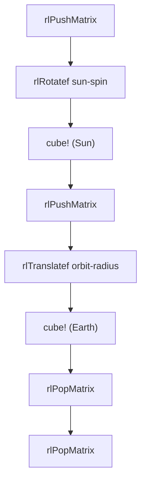

# rlgl immediate mode: for the by-value float structs the pointer trick can't fake

Some raylib calls take a `Vector2` or `Vector3` **by value**: `DrawTriangle(Vector2,
Vector2, Vector2, Color)`, `DrawCube(Vector3, …)`, `DrawSphere(Vector3, …)`. These
are the one FFI case that neither [`color-by-value.md`](color-by-value.md) (packed
`:uint`) nor [`struct-by-value-pointer-trick.md`](struct-by-value-pointer-trick.md)
(pointer for >16 bytes) can handle. The way out is to not call them at all: draw the
same geometry with rlgl's **scalar** immediate mode.

## Why the earlier tricks don't apply

A `Vector2` is 8 bytes of two floats; a `Vector3` is 12 bytes of three floats. Both
are **≤16-byte homogeneous float aggregates (HFAs)**, and the AArch64 ABI passes
those in **floating-point registers**, one field per register, *not* as an integer
(so the `Color` `:uint` trick is out) and *not* indirectly through a pointer (so the
`Camera2D` `[:pointer]` trick is out; that only applies to composites **larger**
than 16 bytes). There is no scalar or pointer binding that reproduces "three floats
in three FP registers." So these functions are simply unbindable from Jolt.

## rlgl is all scalars

raylib ships `rlgl`, a thin immediate-mode layer over the GPU batch. Its vertex API
takes **individual floats**, never a vector struct:

```clojure
;; net.b12n.raylib.rlgl (rl-begin/rl-end/rl-vertex-2f) and
;; net.b12n.raylib.models (rl-vertex-3f)
(ffi/defcfn rl-begin     "rlBegin"     [:int] :void)        ; RL-LINES / RL-TRIANGLES
(ffi/defcfn rl-end       "rlEnd"       [] :void)
(ffi/defcfn rl-vertex-2f "rlVertex2f"  [:float :float] :void)
(ffi/defcfn rl-vertex-3f "rlVertex3f"  [:float :float :float] :void)
(ffi/defcfn rl-color-4ub "rlColor4ub"  [:int :int :int :int] :void)  ; u8 args
(def ^:const RL-LINES 1)
(def ^:const RL-TRIANGLES 4)
```

Every argument is a scalar the FFI passes cleanly. So instead of `DrawTriangle(v1,
v2, v3, color)` you emit `rlBegin(RL_TRIANGLES)`, one `rlColor4ub`, three
`rlVertex2f`, `rlEnd`. The `shapes` example (`net.b12n.raylib-jlt.shapes`) draws its
triangle exactly this way; `rl-color!` (see [`color-by-value.md`](color-by-value.md))
unpacks the shared packed `Color` into the four `u8` args.

## 3D: `cube!` is 12 rlgl triangles

The same move scales to 3D. `with-camera-3d` gets the camera active (via the pointer
trick), but `DrawCube` takes a `Vector3` by value (unbindable), so `cube!` builds a
box out of `rl-vertex-3f`. Each face is a quad = two triangles, and faces are shaded
by darkening the packed color so the cube reads as 3D without a lighting pass:

```clojure
(defn- quad-3f [color [a b c d]]
  (rl-color! color)
  (let [[ax ay az] a [bx by bz] b [cx cy cz] c [dx dy dz] d]
    (rl-vertex-3f ax ay az) (rl-vertex-3f bx by bz) (rl-vertex-3f cx cy cz)
    (rl-vertex-3f ax ay az) (rl-vertex-3f cx cy cz) (rl-vertex-3f dx dy dz)))

(defn cube! [& {:keys [pos size color] :or {pos [0.0 0.0 0.0] size 1.0 color BLACK}}]
  ;; … compute the 8 corners …
  (rl-begin RL-TRIANGLES)
  (quad-3f (shade-color color 1.0)  [a001 a101 a111 a011])   ; front  +z
  (quad-3f (shade-color color 0.5)  [a100 a000 a010 a110])   ; back   -z
  ;; … four more faces at 0.7 / 0.85 / 1.0 / 0.4 brightness …
  (rl-end))
```

`with-camera-3d` + `cube!` are the two 3D building blocks the whole 3D example set
stands on (`camera-3d`, `waving-cubes`, `box-collisions`, …). `DrawGrid` is scalar
(`[:int :float]`) so it's bound and used directly.

`sphere!` is the same idea for a ball, lat/long rings of `RL_TRIANGLES` with faces
shaded by latitude (brighter toward +y), and drives the `bouncing-spheres` example.
`DrawSphere` takes a `Vector3` by value too, so it gets the same rlgl treatment as
the cube.

## The rlgl matrix stack: nested transforms for free

rlgl also exposes its transform stack, and it applies the **current** transform to
each `rlVertex*` at **submit time**. So wrapping push/rotate/translate/scale around a
`cube!` call moves that cube, the same nested-transform model as `BeginMode2D`, but
in scalars:

```clojure
(ffi/defcfn rl-push-matrix "rlPushMatrix" [] :void)
(ffi/defcfn rl-pop-matrix  "rlPopMatrix"  [] :void)
(ffi/defcfn rl-translatef  "rlTranslatef" [:float :float :float] :void)
(ffi/defcfn rl-rotatef     "rlRotatef"    [:float :float :float :float] :void)
(ffi/defcfn rl-scalef      "rlScalef"     [:float :float :float] :void)
```



The `rlgl-solar-system` example (`net.b12n.raylib-jlt.rlgl-solar-system`) uses exactly
this to make Earth orbit the Sun and the Moon orbit Earth: nested push/translate/
rotate around three `cube!` calls, no matrix math in Clojure. It's also the
**portable** substitute for the AArch64-only camera pointer trick (see the x86-64
caveat in [`struct-by-value-pointer-trick.md`](struct-by-value-pointer-trick.md)).

## 2D: filled arcs with `sector!`

The same wall stops `DrawCircleSector` / `DrawRing` / `DrawCircleV`: they take a
`Vector2` center **by value** (a float pair in FP registers), so they're unbindable by
the pointer trick. The fix is the same: draw the arc as an rlgl triangle fan.
`sector!` (in `net.b12n.raylib.kwargs`) builds one:

```clojure
(rl/sector! :cx 270 :cy 235 :radius 165
            :start-deg a0 :end-deg a1 :segments 60 :color slice-color)
```

Each sub-triangle is emitted `rim → center → rim` with the angle **increasing**
(`rim = (sin θ, -cos θ)`, so 0° points up and grows clockwise). That order carries
raylib's **front-facing winding**: a fan wound the other way is silently
backface-culled (raylib enables `GL_CULL_FACE`). Two examples consume it:
`pie-chart` (one fan per slice) and `vector-angle` (a translucent fan for the measured
angle). `color-wheel` draws its own fan directly because it needs a *per-vertex* hue
(a different `rl-color!` before each rim vertex), which a single-color helper can't
express. The showpiece `penrose-tiling` fills ~900 deflation triangles of *mixed*
winding, so it normalizes each to negative signed area (the proven front face) before
the batch, the general form of the winding rule `sector!` bakes in.

## 2D: `ring!` and `line-ex!`

Two more by-value casualties get the same rlgl treatment:

- **`ring!`**: a filled annulus (donut sector), the stand-in for `DrawRing`. Instead
  of a center-anchored fan it walks a **quad strip** between an inner and an outer
  radius: each angular step emits two triangles spanning `inner → outer` across `dθ`,
  wound front-facing. `analog-clock`'s bezel and `ring-drawing` use it.
- **`line-ex!`**: a thick line, the stand-in for `DrawLineEx` (both `Vector2`
  endpoints by value). It offsets the two endpoints by `±thick/2` along the unit
  perpendicular `(dy,-dx)/len` and fills the resulting quad as two triangles. That
  perpendicular convention keeps the quad front-wound at **every** line direction, so
  a rotating fan of them (`lines-drawing`) or a sweeping clock hand (`analog-clock`)
  never flips to a culled back face. `line-ex!` also draws the clock ticks and the
  `ring-drawing` outline stroke.

Both are single-color (`rl-color!` once, then the vertices) and, like `sector!`,
live in `net.b12n.raylib.kwargs`, calling the raw `rl-*` binds in
`net.b12n.raylib.rlgl`.

## Why this generalizes

When a C graphics API forces geometry through by-value small-float-vector arguments,
look for a scalar immediate-mode or builder API on the same library and drive that
instead of fighting the ABI. rlgl is raylib's; many GPU libraries ship an equivalent.
The cost is you re-express shapes as vertex streams: cheap, and it keeps the whole
FFI boundary scalar.

## See also

- [`struct-by-value-pointer-trick.md`](struct-by-value-pointer-trick.md): the
  camera side (>16-byte structs) and why its matrix-op alternative lives here.
- [`color-by-value.md`](color-by-value.md): `rl-color!` shares the packed-`Color`
  representation with the rest of the API.
- [`kwarg-drawing-api.md`](kwarg-drawing-api.md): `cube!` follows the keyword-arg
  convention; the raw `rl-*` binds stay positional.
