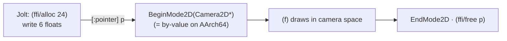

# The struct-by-value pointer trick (`Camera2D` / `Camera3D`)

> **Superseded, and never portable.** This page passes a by-value struct by
> handing C a pointer and relying on AArch64 passing anything over 16 bytes
> indirectly. jolt **0.7.23** added `[:by-value [:struct ...]]`, which expresses
> the same call properly and on every architecture. New bindings should use it -
> see [`structs-by-value.md`](structs-by-value.md).
>
> The trick is still what `with-camera-2d` / `with-camera-3d` do here, so the
> page describes live code. Read the x86-64 caveat below before copying it
> anywhere: on that ABI these structs go on the stack, not behind a pointer, and
> the trick is simply wrong rather than merely unidiomatic.

raylib's cameras are structs passed **by value**: `BeginMode2D(Camera2D)` takes 24
bytes, `BeginMode3D(Camera3D)` takes 44 bytes. Chez `foreign-procedure` (what
`jolt.ffi/defcfn` lowers to) has no by-value-aggregate calling convention. Unlike
`Color` (see [`color-by-value.md`](color-by-value.md)) these are far too big to fake
as a register-width int. But on AArch64 there is still a way, and it comes straight
out of the ABI.

## The ABI fact

```c
typedef struct Camera2D {   // 24 bytes
    Vector2 offset;         //  8  (float x, y)
    Vector2 target;         //  8  (float x, y)
    float   rotation;       //  4
    float   zoom;           //  4
} Camera2D;

void BeginMode2D(Camera2D camera);
```

On the **AArch64** (Apple silicon) procedure-call standard, a composite larger than
16 bytes is passed **indirectly**: the caller allocates the struct somewhere, and
what actually goes in the argument register is a **pointer** to it. So at the machine
level, `BeginMode2D(Camera2D)` and `BeginMode2D(Camera2D*)` are the *same call*: the
callee receives a pointer either way.

That means a Jolt binding can declare the parameter as `[:pointer]`, build the 24
bytes in native memory itself, and pass the pointer. The C side never knows the
difference.

## The Jolt side

`lib/src/net/b12n/raylib/camera.clj` binds `BeginMode2D` as a pointer taker and builds
the struct with `ffi/alloc` + six little-endian `ffi/write :float`s:

```clojure
(ffi/defcfn ^:private begin-mode-2d-ptr "BeginMode2D" [:pointer] :void)
(ffi/defcfn end-mode-2d "EndMode2D" [] :void)

(defn with-camera-2d
  [{:keys [offset-x offset-y target-x target-y rotation zoom]
    :or {offset-x 0 offset-y 0 target-x 0 target-y 0 rotation 0 zoom 1.0}} f]
  (let [p (ffi/alloc 24)]
    (try
      (ffi/write p :float (double offset-x) 0)
      (ffi/write p :float (double offset-y) 4)
      (ffi/write p :float (double target-x) 8)
      (ffi/write p :float (double target-y) 12)
      (ffi/write p :float (double rotation) 16)
      (ffi/write p :float (double zoom) 20)
      (begin-mode-2d-ptr p)
      (f)
      (end-mode-2d)
      (finally (ffi/free p)))))
```

The struct layout is the whole game: **the field byte-offsets must match the C
struct exactly** (0, 4, 8, 12 for the four `Vector2` floats, then 16 = rotation,
20 = zoom), and the buffer size must equal `sizeof(Camera2D)` = 24. Get either wrong
and you read garbage or corrupt the stack.



## Camera3D is the same recipe, bigger

`Camera3D` is 44 bytes: three `Vector3` (position, target, up) + a `float fovy` +
an `int projection`. `with-camera-3d` allocates 44 and writes ten floats then one
int:

```clojure
(let [p (ffi/alloc 44)]
  ;; … nine (ffi/write p :float …) at offsets 0..32 …
  (ffi/write p :float (double fovy) 36)
  (ffi/write p :int (int projection) 40)     ; 0 = perspective
  (begin-mode-3d-ptr p) (f) (end-mode-3d))
```

Both wrappers use `try`/`finally` so the native buffer is freed even if `f` throws,
the same discipline the sibling project applies to its node buffers.

## The x86-64 caveat: this is **not** portable as written

The trick works *because* AArch64 passes >16-byte structs indirectly. On the
**x86-64 System V** ABI, those 24 bytes are classified and passed **on the stack**
(in pieces), which a `[:pointer]` binding does **not** do; it would put a pointer
where the callee expects 24 bytes of struct data, and the call reads garbage
(typically an "invalid memory reference" crash).

So `camera2d`/`camera-3d` are AArch64-only as written. The **portable** alternative
is to skip `BeginMode2D` entirely and apply the same transform with rlgl's scalar
matrix ops (`rlPushMatrix`/`rlTranslatef`/`rlRotatef`/`rlScalef`), which is exactly
what `BeginMode2D` does internally. See [`rlgl-immediate-mode.md`](rlgl-immediate-mode.md)
for the matrix stack. The source flags this inline:

```clojure
;; NOTE: this is AArch64-specific. On the x86-64 SysV ABI the 24 bytes are passed
;; on the stack, which a [:pointer] binding does NOT do (see README). For a portable
;; alternative, apply the same transform with the scalar rlgl matrix ops instead.
```

## By-value **returns** are a different, harder problem

This trick fakes a by-value struct **argument**. It does nothing for a function that
**returns** a struct by value: on AArch64 that uses the `x8` sret register, which
Chez doesn't expose. raylib's hot path never needs a by-value struct return, so this
repo never hits it. Its Jolt sibling `b12n-tsj` (not yet public) is not so lucky:
tree-sitter's
`ts_tree_root_node` **returns** a 32-byte `TSNode` by value and `ts_node_type`
**takes** one, so it can't fake either direction with a pointer binding and must ship
a C shim. That contrast is the reason both projects exist side by side.

## Why this generalizes

For any Chez/Jolt FFI on AArch64 that needs to pass a >16-byte struct **by value**:
allocate `sizeof(T)` with `ffi/alloc`, write each field at its C offset, bind the
function as `[:pointer]`, and free in `finally`. Confirm `sizeof` and every offset
against the C header. Do **not** assume it ports to x86-64; reach for rlgl matrix
ops (or a real shim) there.

## See also

- [`color-by-value.md`](color-by-value.md): the small-struct case that fits in a
  register and needs none of this.
- [`rlgl-immediate-mode.md`](rlgl-immediate-mode.md): the portable matrix-stack
  alternative, and the fallback for by-value *float* structs (`Vector2`/`Vector3`).
- `b12n-tsj` (not yet public): the sibling case where the pointer trick isn't
  enough (by-value returns) and you must write a C shim.
